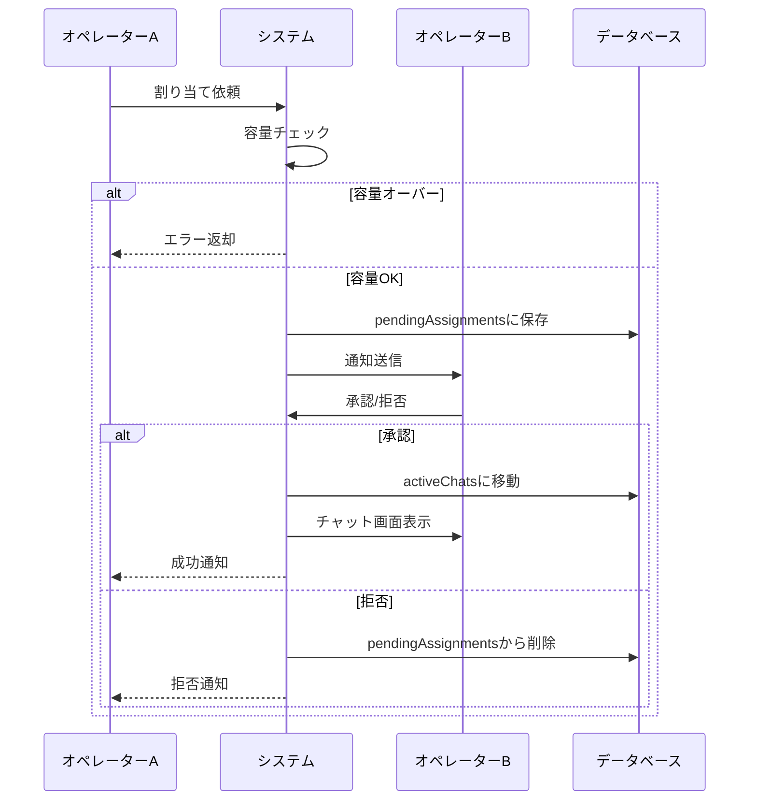
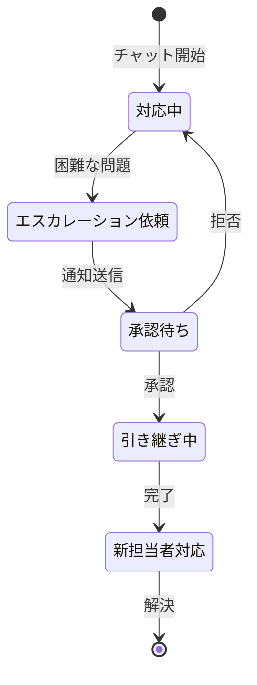

# カスタマーサポートチャットシステム

## 概要

このディレクトリには、企業向けカスタマーサポートチャットシステムの実装が含まれています。リアルタイムでの顧客対応、複数チャットの同時管理、オペレーター間の負荷分散など、実際のコールセンターで必要とされる機能を提供します。

## 主要機能

1. **マルチチャット対応**: タブ形式で複数の顧客と同時に対話
2. **問い合わせキュー管理**: 優先度とSLA期限に基づく効率的な割り当て
3. **オペレーター管理**: ステータス管理と負荷分散
4. **履歴管理**: 過去の対応履歴の検索・閲覧
5. **リアルタイム更新**: WebSocketによる即時通知（モック実装済み）

## アーキテクチャ

### ディレクトリ構成

```
/chat/
├── api/                      # API通信層
│   ├── mockService.js        # モックAPI実装
│   ├── database-schema.sql   # データベース設計
│   ├── errorHandler.js       # エラーハンドリング
│   ├── validators.js         # バリデーション
│   └── demoDataGenerator.js  # デモデータ生成
├── +page.js                  # ページ初期化
├── +page.svelte              # メインページ
├── supportStore.js           # 状態管理（Svelteストア）
├── ChatTabs.svelte           # チャットタブ管理
├── SupportChat.svelte        # チャット本体
├── CustomerInfo.svelte       # 顧客情報パネル
├── InquiryQueue.svelte       # 問い合わせキュー
├── ChatHistory.svelte        # 履歴画面
└── OperatorDashboard.svelte  # ダッシュボード
```

### データフロー

```
[API Layer] ←→ [Store Layer] ←→ [UI Components]
     ↑              ↑                    ↑
     |              |                    |
[Database]    [WebSocket]         [User Actions]
```

## データベース設計

### 主要テーブル

#### 1. operators（オペレーター）

```sql
- id: オペレーターID
- email: メールアドレス
- name: 氏名
- department: 部署
- role: 役割（senior/regular/supervisor）
- max_concurrent_chats: 同時対応可能数
- is_active: アクティブフラグ
```

#### 2. customers（顧客）

```sql
- id: 顧客ID
- email: メールアドレス
- name: 氏名
- tier: 会員ランク（ゴールド/シルバー/ブロンズ）
- is_vip: VIPフラグ
- total_purchase_amount: 累計購入金額
```

#### 3. inquiries（問い合わせ）

```sql
- id: 問い合わせID
- customer_id: 顧客ID
- subject: 件名
- initial_message: 初回メッセージ
- category: カテゴリー
- priority: 優先度
- status: ステータス
- sla_deadline: SLA期限
```

#### 4. chat_sessions（チャットセッション）

```sql
- id: セッションID
- inquiry_id: 問い合わせID
- customer_id: 顧客ID
- operator_id: オペレーターID
- start_time: 開始時刻
- end_time: 終了時刻
- resolution: 解決ステータス
- satisfaction_score: 満足度評価
```

#### 5. messages（メッセージ）

```sql
- id: メッセージID
- chat_session_id: セッションID
- sender_type: 送信者タイプ（customer/agent/system）
- content: メッセージ内容
- created_at: 作成日時
```

詳細は [`api/database-schema.sql`](./api/database-schema.sql) を参照してください。

## API仕様

### 基本構造

すべてのAPIレスポンスは以下の形式です：

```javascript
{
  success: boolean,
  data?: any,
  error?: string,
  meta?: {
    page?: number,
    total?: number
  }
}
```

### 主要エンドポイント

#### オペレーター関連

- `GET /api/operators` - 全オペレーター取得
- `GET /api/operators/me` - 現在のオペレーター情報
- `PATCH /api/operators/:id/status` - ステータス更新

#### 問い合わせ関連

- `POST /api/inquiries` - 新規問い合わせ作成
- `GET /api/inquiries?status=waiting` - 待機中問い合わせ取得
- `POST /api/inquiries/:id/assign` - オペレーター割り当て

#### チャット関連

- `GET /api/chats/active` - アクティブチャット取得
- `POST /api/chats/:id/messages` - メッセージ送信
- `POST /api/chats/:id/resolve` - チャット終了
- `GET /api/chats/history` - 履歴取得

### WebSocket イベント

```javascript
// 新規問い合わせ
socket.on('new-inquiry', (inquiry) => { ... });

// 新着メッセージ
socket.on('new-message', (message) => { ... });

// オペレーターステータス変更
socket.on('operator-status-changed', (operator) => { ... });
```

## モックモードと本番モード

このチャットシステムは、開発/デモ用のモックモードと本番モードを切り替えて使用できます。

### モード切り替え方法

`config.js` ファイルの `USE_CHAT_MOCK` を変更：

```javascript
// config.js
export const USE_CHAT_MOCK = true; // モックモード（デフォルト）
export const USE_CHAT_MOCK = false; // 本番モード
```

### モックモードの特徴

- **自動データ生成**: 定期的に新しい問い合わせが自動生成される
- **新規問い合わせボタン**: ヘッダーに手動で問い合わせを作成するボタンが表示
- **初期データ**: ページロード時に自動的にサンプル問い合わせが生成
- **ローカル動作**: APIサーバーなしで完全に動作

### 本番モードの特徴

- **実API通信**: 実際のバックエンドAPIと通信
- **リアルタイムデータ**: WebSocketまたはポーリングで最新情報を取得
- **認証必須**: ログイン済みのオペレーター情報が必要
- **自動生成なし**: デモデータの自動生成機能は無効

### 設定項目（config.js）

```javascript
// デモデータ生成設定（モックモードのみ有効）
export const DEMO_CONFIG = {
	initialInquiryCount: 3, // 初期問い合わせ数
	autoGenerateInterval: 10000, // 自動生成間隔（ミリ秒）
	autoGenerateProbability: 0.3, // 自動生成確率
	showNewInquiryButton: true // 新規問い合わせボタンの表示
};
```

## カスタマイズガイド

### 1. API接続の実装

本番モードで実際のAPIに接続する：

```javascript
// config.js でモードを切り替え
export const USE_CHAT_MOCK = false;

// api/mockService.js の各関数に実際のAPI呼び出しを実装
// 例: operatorAPI.getAll() の本番実装を追加
```

### 2. 認証の追加

```javascript
// api/auth.js を作成
export async function getAuthHeaders() {
	const token = await getAccessToken();
	return {
		Authorization: `Bearer ${token}`,
		'Content-Type': 'application/json'
	};
}

// mockService.js で使用
const response = await fetch(url, {
	headers: await getAuthHeaders(),
	...options
});
```

### 3. カテゴリーの追加

```javascript
// supportStore.js
export const inquiryCategories = {
	shipping: { label: '配送', icon: '📦' },
	return: { label: '返品', icon: '↩️' },
	// 新しいカテゴリーを追加
	warranty: { label: '保証', icon: '🛡️' }
};
```

### 4. 優先度ルールのカスタマイズ

```javascript
// supportStore.js の determinePriority 関数を編集
function determinePriority(customerData) {
	// カスタムルールを追加
	if (customerData.totalPurchaseAmount > 1000000) {
		return 'urgent';
	}
	// 既存のルール...
}
```

### 5. UIテーマのカスタマイズ

DaisyUI のテーマを使用：

```javascript
// tailwind.config.js
module.exports = {
	daisyui: {
		themes: [
			{
				corporate: {
					primary: '#0066cc',
					secondary: '#6b7280'
					// カスタムカラー
				}
			}
		]
	}
};
```

### 6. 通知音の追加

```javascript
// 新着問い合わせ時の通知音
mockWebSocket.simulateNewInquiry((inquiry) => {
	inquiryQueue.update((queue) => [...queue, inquiry]);

	// 通知音を再生
	const audio = new Audio('/notification.mp3');
	audio.play();
});
```

## パフォーマンス最適化

### 1. メッセージの仮想スクロール

大量のメッセージを扱う場合：

```javascript
import VirtualList from '@tanstack/svelte-virtual';

// SupportChat.svelte で使用
{#if messages.length > 100}
  <VirtualList items={messages} />
{:else}
  <!-- 通常の表示 -->
{/if}
```

### 2. ストアの最適化

頻繁に更新されるデータの分離：

```javascript
// メッセージを別ストアに分離
export const messagesByChat = writable(new Map());

// 個別のチャットメッセージのみ更新
messagesByChat.update((map) => {
	map.set(chatId, [...(map.get(chatId) || []), newMessage]);
	return new Map(map);
});
```

### 3. API呼び出しのデバウンス

```javascript
import { debounce } from '$lib/utils';

const debouncedSearch = debounce((query) => {
	searchAPI(query);
}, 300);
```

## セキュリティ考慮事項

### 1. XSS対策

```javascript
// validators.js の escapeHtml を使用
import { escapeHtml } from './api/validators.js';

// ユーザー入力を表示する際
<div>{escapeHtml(userMessage)}</div>;
```

### 2. CSRF対策

```javascript
// APIリクエストにCSRFトークンを含める
const response = await fetch(url, {
	headers: {
		'X-CSRF-Token': getCsrfToken()
	}
});
```

### 3. 権限チェック

```javascript
// 操作前に権限を確認
if (!hasPermission('chat.assign')) {
	throw new Error('この操作を実行する権限がありません');
}
```

## トラブルシューティング

### よくある問題

1. **リアクティビティが動作しない**

   - ストアの更新時にイミュータブルな操作を使用しているか確認
   - `{@const}` の代わりに `$derived` を使用

2. **APIエラーが表示されない**

   - errorHandler が適切にインポートされているか確認
   - try-catch ブロックでエラーをキャッチしているか確認

3. **WebSocketが接続されない**
   - CORS設定を確認
   - WebSocketサーバーのURLが正しいか確認

## 開発環境のセットアップ

```bash
# 依存関係のインストール
pnpm install

# 開発サーバーの起動
pnpm dev

# モックモードで起動
VITE_USE_MOCK=true pnpm dev

# 本番ビルド
pnpm build
```

## テスト

```bash
# ユニットテスト
pnpm test:unit

# E2Eテスト
pnpm test:e2e

# 全テスト実行
pnpm test
```

## ライセンス

このプロジェクトは[MITライセンス](LICENSE)の下で公開されています。

## 貢献

プルリクエストを歓迎します。大きな変更の場合は、まずissueを作成して変更内容を議論してください。

## サポート

質問や問題がある場合は、[GitHubのissue](https://github.com/yourrepo/issues)を作成してください。

---

## エスカレーション・割り当て機能の詳細設計

### 概要

本システムでは、複数のオペレーターが協調して顧客対応を行うため、適切な割り当てとエスカレーションの仕組みが重要です。以下、本番実装時の考慮点と想定される動作を詳述します。

### 1. 割り当て機能の設計

#### 1.1 通常の割り当てフロー



#### 1.2 自己割り当てフロー

自分自身への割り当ては、通知・承認プロセスをスキップして即座に実行されます。

```javascript
// supportStore.js - assignToSelf関数
export async function assignToSelf(inquiryId) {
	// 1. 容量チェック
	// 2. 直接APIを呼び出し
	// 3. activeChatsに追加
	// 4. 自動的にselectedChatIdを設定
}
```

#### 1.3 容量管理

各オペレーターには同時対応可能数（`maxConcurrent`）が設定されています。

```javascript
// オペレーターの容量状態
{
  current: 2,      // 現在の対応数
  max: 3,          // 最大同時対応数
  canTakeMore: true // 追加対応可能か
}
```

**実装時の考慮点：**

- リアルタイムでの容量更新（WebSocket推奨）
- 割り当て時の楽観的ロック
- 同時アクセス時の競合制御

### 2. エスカレーション機能の設計

#### 2.1 エスカレーションフロー



#### 2.2 エスカレーション時のデータ引き継ぎ

```javascript
// エスカレーション時に保持されるデータ
{
  chat: {            // チャット基本情報
    id,
    customerId,
    category,
    priority,
    startTime
  },
  messages: [...],   // 全メッセージ履歴
  reason: "...",     // エスカレーション理由
  previousOperator: {...} // 前担当者情報
}
```

#### 2.3 実装時の重要ポイント

1. **メッセージ履歴の完全性**

   - エスカレーション前の全メッセージを保持
   - システムメッセージでエスカレーションを記録
   - タイムスタンプの整合性維持

2. **状態遷移の管理**

   ```javascript
   // チャットステータスの遷移
   active → escalation_pending → active（新担当者）
   ```

3. **通知の優先度**
   - エスカレーション通知は高優先度
   - スキル適合性を考慮した通知先選定

### 3. 通知システムの設計

#### 3.1 通知の種類と優先度

```javascript
const notificationTypes = {
	assignment: {
		// 新規割り当て
		priority: 'normal',
		requiresAction: true,
		timeout: 30000 // 30秒でタイムアウト
	},
	escalation: {
		// エスカレーション
		priority: 'high',
		requiresAction: true,
		timeout: 60000 // 60秒でタイムアウト
	},
	info: {
		// 情報通知
		priority: 'low',
		requiresAction: false
	},
	warning: {
		// 警告
		priority: 'high',
		requiresAction: false
	}
};
```

#### 3.2 通知のライフサイクル

1. **作成**: `addNotification()`
2. **配信**: WebSocket/SSEで即座に配信
3. **表示**: NotificationPanelで表示
4. **アクション**: 承認/拒否/既読
5. **削除**: 自動削除またはマニュアル削除

### 4. 本番実装時のアーキテクチャ推奨

#### 4.1 バックエンドAPI設計

```typescript
// 割り当てAPI
POST /api/chat/inquiries/:id/assign
{
  targetOperatorId: string,
  requestedBy: string,
  priority: 'normal' | 'urgent'
}

// エスカレーションAPI
POST /api/chat/sessions/:id/escalate
{
  targetOperatorId: string,
  reason: string,
  urgency: 'normal' | 'high' | 'critical'
}

// 承認/拒否API
POST /api/chat/assignments/:id/accept
POST /api/chat/assignments/:id/reject
{
  reason?: string
}
```

#### 4.2 リアルタイム通信

**WebSocket実装例：**

```javascript
// クライアント側
const ws = new WebSocket('wss://api.example.com/chat/ws');

ws.on('assignment_request', (data) => {
	notifications.update((n) => [...n, data.notification]);
	pendingAssignments.update((p) => ({ ...p, [data.id]: data }));
});

ws.on('assignment_accepted', (data) => {
	if (data.requestedBy === currentOperatorId) {
		// 依頼者に成功を通知
		showToast('割り当てが承認されました');
	}
});
```

#### 4.3 データベース設計

```sql
-- 割り当て承認待ちテーブル
CREATE TABLE pending_assignments (
  id UUID PRIMARY KEY,
  type ENUM('assignment', 'escalation'),
  chat_id UUID NOT NULL,
  target_operator_id UUID NOT NULL,
  requested_by UUID NOT NULL,
  requested_at TIMESTAMP NOT NULL,
  reason TEXT,
  expires_at TIMESTAMP NOT NULL,
  status ENUM('pending', 'accepted', 'rejected', 'expired'),
  FOREIGN KEY (chat_id) REFERENCES chats(id),
  FOREIGN KEY (target_operator_id) REFERENCES operators(id),
  FOREIGN KEY (requested_by) REFERENCES operators(id)
);

-- 通知テーブル
CREATE TABLE notifications (
  id UUID PRIMARY KEY,
  operator_id UUID NOT NULL,
  type VARCHAR(50) NOT NULL,
  title VARCHAR(255) NOT NULL,
  message TEXT,
  related_id UUID,
  priority ENUM('low', 'normal', 'high'),
  read_at TIMESTAMP,
  created_at TIMESTAMP NOT NULL,
  expires_at TIMESTAMP,
  FOREIGN KEY (operator_id) REFERENCES operators(id)
);
```

### 5. エラーハンドリングと例外ケース

#### 5.1 タイムアウト処理

```javascript
// 承認待ちタイムアウトの処理
function handleAssignmentTimeout(assignmentId) {
	// 1. pendingAssignmentsから削除
	// 2. 依頼者に通知
	// 3. 問い合わせをキューに戻す
	// 4. ログ記録
}
```

#### 5.2 競合状態の処理

- **同時承認**: 最初の承認のみ有効、後続は拒否
- **容量超過**: 承認時に再チェック、超過なら自動拒否
- **オフライン遷移**: 承認待ちを自動拒否

#### 5.3 フォールバック戦略

```javascript
// エスカレーション先が見つからない場合
if (availableOperators.length === 0) {
	// 1. スーパーバイザーに通知
	// 2. 優先度を最高に設定
	// 3. 全オペレーターに通知
}
```

### 6. パフォーマンス最適化

#### 6.1 通知の効率化

- バッチ処理による通知配信
- 重複通知の排除
- 優先度ベースの配信順序

#### 6.2 状態管理の最適化

```javascript
// 大規模環境での最適化
// pendingAssignmentsの定期クリーンアップ
setInterval(() => {
	const now = Date.now();
	pendingAssignments.update((assignments) => {
		return Object.fromEntries(
			Object.entries(assignments).filter(([_, a]) => new Date(a.expiresAt) > now)
		);
	});
}, 60000); // 1分ごと
```

### 7. セキュリティ考慮事項

1. **権限チェック**

   - エスカレーション権限の確認
   - スキルレベルによる制限

2. **監査ログ**

   ```javascript
   // 全ての割り当て・エスカレーションを記録
   auditLog.record({
   	action: 'ESCALATION_REQUEST',
   	operator: currentOperator,
   	target: targetOperator,
   	reason: escalationReason,
   	timestamp: new Date()
   });
   ```

3. **データ保護**
   - エスカレーション時の顧客情報アクセス制御
   - メッセージ履歴の暗号化

### 8. テストシナリオ

本番実装時に確認すべきテストケース：

1. **正常系**

   - 通常の割り当て承認
   - エスカレーション承認
   - 複数同時割り当て

2. **異常系**

   - タイムアウト
   - 容量超過
   - ネットワーク切断
   - 同時アクセス

3. **境界値**
   - 最大容量での動作
   - 0件での動作
   - 大量通知時の動作

これらの設計と考慮事項を踏まえて実装することで、堅牢で拡張性の高いカスタマーサポートシステムを構築できます。

---

## 2025年6月の更新内容

### 修正されたバグ

1. **チャット履歴の保存**

   - `resolveChat`関数でアーカイブへの保存が正しく動作するよう修正
   - `endTime`/`endDate`プロパティの不整合を解決
   - 個人履歴タブで`assignedTo`フィールドを正しく参照

2. **通知のちらつき問題**
   - 自分への割り当て専用関数`assignToSelf`を追加
   - 通知・承認フローをスキップして即座に割り当て

### 新機能

#### 1. 通知システム

- **NotificationPanel.svelte**: リアルタイム通知表示
- 割り当て/エスカレーションの承認/拒否機能
- 未読バッジ表示

#### 2. テスト・デバッグパネル

- **TestPanel.svelte**: 開発/デモ用の統合テストツール
- オペレーター切り替え機能
- デバッグモード設定（自動生成・自動返信のON/OFF）
- 問い合わせ生成ボタンを統合
- ギアアイコンから調整アイコンに変更（テスト用であることを明示）

#### 3. 割り当て・エスカレーションフローの改善

```javascript
// 新しい関数
- requestAssignInquiry: 割り当て依頼（通知送信）
- acceptAssignment: 割り当て承認
- rejectAssignment: 割り当て拒否
- assignToSelf: 自分への即座割り当て（通知なし）
- requestEscalateChat: エスカレーション依頼
- acceptEscalation: エスカレーション承認
- rejectEscalation: エスカレーション拒否
```

#### 4. データの明確な分離

- 仮想顧客名に「様」を付けてオペレーター名と区別
- debugStore.jsでデバッグ設定を一元管理

### アーキテクチャの改善

#### 新しいストア

- `notifications`: 通知キュー
- `pendingAssignments`: 承認待ちの割り当て/エスカレーション
- `debugSettings`: デバッグモード設定

#### コンポーネント構成

```
/chat/
├── +page.svelte           # メインページ
├── NotificationPanel.svelte  # 通知パネル（新規）
├── TestPanel.svelte         # テストパネル（新規）
├── api/
│   ├── debugStore.js       # デバッグ設定管理（新規）
│   └── demoDataGenerator.js # 顧客名を「様」付きに変更
└── ...（既存ファイル）
```

### 使い方

1. **テストパネル**

   - 画面右下の黄色い調整アイコンをクリック
   - 「問い合わせ自動生成」と「顧客自動返信」をON/OFF可能
   - 新規問い合わせボタンもこちらに統合

2. **通知パネル**

   - ヘッダーのベルアイコンをクリック
   - 割り当てやエスカレーションの承認/拒否が可能

3. **オペレーター切り替え**
   - テストパネル内で現在のオペレーターを変更可能
   - 複数オペレーターの動作をシミュレート

### 注意事項

- テスト機能は`USE_CHAT_MOCK = true`の時のみ有効
- 自動生成・自動返信はデフォルトでOFF
- 通知はオペレーターごとにフィルタリング
