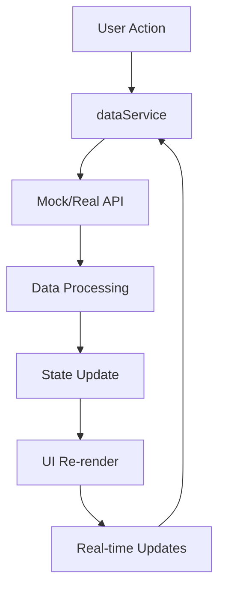

# 在庫・物流管理ダッシュボード

## 概要

このダッシュボードは、企業の在庫管理・物流オペレーションの最適化を目的とした、リアルタイム監視・分析システムです。AI駆動の予測分析、ヒートマップによる視覚化、地理的配送追跡を組み合わせて、サプライチェーン全体の効率化を支援します。

### 🎯 対象ユーザー

- **物流マネージャー**: 配送状況の監視と最適化
- **倉庫管理者**: 在庫レベルの調整と倉庫運営効率化
- **経営陣**: KPI監視と戦略的意思決定
- **AIエンジニア**: 予測モデルのパフォーマンス監視

### 🚀 主要機能

1. **リアルタイム在庫監視**

   - カテゴリ別・倉庫別ヒートマップ
   - 低在庫・過剰在庫の自動アラート
   - 在庫回転率とトレンド分析

2. **配送・物流追跡**

   - 地図上でのリアルタイム配送状況表示
   - 配送ルートの可視化
   - 遅延アラートと配送効率指標

3. **AI予測分析**

   - 需要予測（7日〜365日）
   - ルート最適化提案
   - 在庫最適化レコメンデーション
   - コスト削減シミュレーション

4. **倉庫運営管理**
   - 倉庫使用率の監視
   - 容量管理とアラート
   - 作業効率指標

## アーキテクチャ

### システム構成

```
┌─────────────────┐    ┌──────────────────┐    ┌─────────────────┐
│   Frontend      │    │   Backend API    │    │   Database      │
│   (SvelteKit)   │◄──►│   (REST/WS)      │◄──►│   (MySQL/       │
│                 │    │                  │    │    PostgreSQL)  │
│   - Dashboard   │    │   - Inventory    │    │                 │
│   - Realtime    │    │   - Logistics    │    │   - Warehouses  │
│   - Analytics   │    │   - Analytics    │    │   - Inventory   │
│                 │    │   - Predictions  │    │   - Deliveries  │
└─────────────────┘    └──────────────────┘    └─────────────────┘
                                │
                       ┌──────────────────┐
                       │   External APIs  │
                       │                  │
                       │   - Maps API     │
                       │   - ML Platform  │
                       │   - IoT Sensors  │
                       └──────────────────┘
```

### データフロー

1. **リアルタイムデータ収集**

   - IoTセンサーからの在庫レベル
   - GPS追跡による配送位置
   - 倉庫管理システムからの入出荷情報

2. **データ処理・分析**

   - バッチ処理による履歴データ分析
   - リアルタイムストリーム処理
   - 機械学習による予測モデル実行

3. **UI更新**
   - WebSocket経由のリアルタイム更新
   - 定期的なデータポーリング
   - ユーザーアクション後の即座更新

### 技術スタック

- **Frontend**: SvelteKit 2.16+, Svelte 5 (runes)
- **UI Framework**: DaisyUI 5.0.35+, Tailwind CSS 4.1.7
- **状態管理**: Svelte stores + reactive statements
- **通信**: Fetch API, WebSocket
- **地図表示**: 軽量地図ライブラリ（本番では Mapbox/Google Maps）
- **チャート**: CSS Grid + SVG（本番では Chart.js/D3.js推奨）

## ファイル構造

```
src/routes/sample/dashboards/04/
├── README.md                    # 本ドキュメント
├── +page.svelte                 # メインダッシュボード
├── config.js                    # 設定・定数
├── InventoryHeatmap.svelte      # 在庫ヒートマップコンポーネント
├── DeliveryMap.svelte          # 配送マップコンポーネント
├── WarehouseStatus.svelte      # 倉庫状況コンポーネント
├── AnalyticsPanel.svelte       # AI分析パネルコンポーネント
└── services/
    ├── dataService.js          # データ取得統一インターフェース
    └── mockDataService.js      # モックデータ生成（開発用）
```

### コンポーネント設計思想

1. **単一責任の原則**: 各コンポーネントは特定の機能領域に集中
2. **データフロー**: 親→子のprops、子→親のイベント
3. **リアクティビティ**: Svelte 5のrunesを活用した効率的な更新
4. **再利用性**: 汎用的なコンポーネントはlibディレクトリで管理

## 設定とカスタマイズ

### 基本設定 (config.js)

```javascript
export const config = {
	// モック/本番切り替え
	USE_MOCK_DATA: true,

	// API設定
	API_ENDPOINTS: {
		WAREHOUSES: '/api/v1/warehouses',
		INVENTORY: '/api/v1/inventory'
		// ...
	},

	// リフレッシュ間隔
	REFRESH_INTERVALS: {
		DELIVERY_TRACKING: 15000,
		INVENTORY_LEVELS: 60000
		// ...
	}
};
```

### フィーチャーフラグ

開発・本番・A/Bテスト用の機能切り替え：

```javascript
export const featureFlags = {
	SHOW_REAL_TIME_TRACKING: { enabled: true },
	ENABLE_AI_OPTIMIZATION: { enabled: false },
	SHOW_SAMPLE_DELIVERIES: { enabled: config.USE_MOCK_DATA, mockModeOnly: true }
};
```

### UI設定

テーマカラー、アニメーション、レスポンシブ設定を一元管理：

```javascript
export const uiConfig = {
	COLORS: {
		WAREHOUSE: '#10b981',
		IN_TRANSIT: '#3b82f6'
		// ...
	},
	ANIMATIONS: {
		MAP_MARKERS: { DURATION: 2000 }
	}
};
```

## 主要コンポーネント解説

### 1. メインダッシュボード (+page.svelte)

**機能**: 4つのビューモード切り替えとKPI表示

**主要機能**:

- 概要/在庫/物流/分析の4つのビュー
- リアルタイム状況バナー
- アラート通知ドロップダウン
- KPI指標カード表示

**データ依存**:

- `dataService.getAnalyticsData()` - KPI指標
- `dataService.getAlerts()` - アラート情報
- WebSocket経由のリアルタイム更新

### 2. 在庫ヒートマップ (InventoryHeatmap.svelte)

**機能**: カテゴリ別・倉庫別の在庫レベル可視化

**視覚要素**:

- グラデーション背景による在庫密度表現
- ステータスインジケーター（正常/警告/危険）
- プログレスバーによる稼働率表示
- ホバー時の詳細ツールチップ

**インタラクション**:

- カテゴリフィルタリング
- セル選択による詳細表示
- リアルタイム更新

### 3. 配送マップ (DeliveryMap.svelte)

**機能**: 地理的配送状況の監視

**表示要素**:

- 疑似地図グリッド
- 配送車両の現在位置
- ルート表示
- 配送ステータス別カラーリング

**パフォーマンス指標**:

- 配送中/完了/遅延の件数
- 平均配送時間
- 燃費効率

### 4. 倉庫状況 (WarehouseStatus.svelte)

**機能**: 倉庫使用率と運営状況監視

**表示内容**:

- 使用率プログレスバー
- 容量情報（総容量/利用可能容量）
- 責任者情報
- 月間処理量
- アラート表示

**表示制御**:

- 概要表示（6倉庫）+ 「すべて表示」ボタン
- 詳細情報の展開表示

### 5. AI分析パネル (AnalyticsPanel.svelte)

**機能**: AI駆動の予測分析と最適化提案

**分析タイプ**:

1. **需要予測**: 商品別需要トレンド、売上予測
2. **ルート最適化**: 配送距離削減、コスト効率化
3. **在庫最適化**: 適正在庫レベル提案
4. **コスト分析**: 削減可能領域の特定

**実行可能アクション**:

- 在庫アラート設定最適化
- 配送ルート統合
- 季節商品事前発注
- 倉庫レイアウト改善

---

## データベース設計詳細

### 核心テーブル設計

#### 1. 地域マスター (locations)

```sql
CREATE TABLE locations (
  id BIGINT PRIMARY KEY AUTO_INCREMENT,
  name VARCHAR(100) NOT NULL,
  prefecture VARCHAR(50),
  latitude DECIMAL(10,7) NOT NULL,
  longitude DECIMAL(10,7) NOT NULL,
  timezone VARCHAR(50) DEFAULT 'Asia/Tokyo',
  is_active BOOLEAN DEFAULT TRUE,
  created_at TIMESTAMP DEFAULT CURRENT_TIMESTAMP,

  INDEX idx_coordinates (latitude, longitude),
  INDEX idx_prefecture (prefecture)
);
```

#### 2. 倉庫マスター (warehouses)

```sql
CREATE TABLE warehouses (
  id BIGINT PRIMARY KEY AUTO_INCREMENT,
  name VARCHAR(200) NOT NULL,
  code VARCHAR(50) UNIQUE NOT NULL,
  location_id BIGINT REFERENCES locations(id),
  address TEXT,
  capacity INTEGER NOT NULL,
  current_utilization DECIMAL(5,2) DEFAULT 0,
  manager_id BIGINT REFERENCES employees(id),
  status ENUM('active', 'maintenance', 'closed') DEFAULT 'active',
  monthly_throughput INTEGER,
  categories JSON COMMENT '取り扱いカテゴリID配列',
  created_at TIMESTAMP DEFAULT CURRENT_TIMESTAMP,
  updated_at TIMESTAMP DEFAULT CURRENT_TIMESTAMP ON UPDATE CURRENT_TIMESTAMP,

  INDEX idx_status (status),
  INDEX idx_location (location_id),
  INDEX idx_utilization (current_utilization)
);
```

#### 3. 商品カテゴリ (product_categories)

```sql
CREATE TABLE product_categories (
  id BIGINT PRIMARY KEY AUTO_INCREMENT,
  code VARCHAR(50) UNIQUE NOT NULL,
  name VARCHAR(100) NOT NULL,
  icon VARCHAR(10),
  color VARCHAR(20),
  turnover_type ENUM('low', 'medium', 'high', 'seasonal'),
  parent_id BIGINT REFERENCES product_categories(id),
  display_order INTEGER DEFAULT 0,
  is_active BOOLEAN DEFAULT TRUE,
  created_at TIMESTAMP DEFAULT CURRENT_TIMESTAMP,

  INDEX idx_parent (parent_id),
  INDEX idx_active_order (is_active, display_order)
);
```

#### 4. ブランドマスター (brands)

```sql
CREATE TABLE brands (
  id BIGINT PRIMARY KEY AUTO_INCREMENT,
  name VARCHAR(100) NOT NULL,
  country VARCHAR(50),
  logo_url VARCHAR(255),
  is_active BOOLEAN DEFAULT TRUE,
  created_at TIMESTAMP DEFAULT CURRENT_TIMESTAMP,

  INDEX idx_country (country),
  INDEX idx_active (is_active)
);
```

#### 5. 商品マスター (products)

```sql
CREATE TABLE products (
  id BIGINT PRIMARY KEY AUTO_INCREMENT,
  sku VARCHAR(100) UNIQUE NOT NULL,
  name VARCHAR(300) NOT NULL,
  category_id BIGINT REFERENCES product_categories(id),
  brand_id BIGINT REFERENCES brands(id),
  unit_cost DECIMAL(10,2),
  unit_price DECIMAL(10,2),
  weight DECIMAL(8,3) COMMENT 'kg',
  dimensions JSON COMMENT 'width, height, depth in cm',
  turnover_rate DECIMAL(5,2) COMMENT '月間回転率',
  min_stock_threshold INTEGER DEFAULT 10,
  max_stock_threshold INTEGER DEFAULT 1000,
  is_active BOOLEAN DEFAULT TRUE,
  created_at TIMESTAMP DEFAULT CURRENT_TIMESTAMP,
  updated_at TIMESTAMP DEFAULT CURRENT_TIMESTAMP ON UPDATE CURRENT_TIMESTAMP,

  INDEX idx_category (category_id),
  INDEX idx_brand (brand_id),
  INDEX idx_sku (sku),
  INDEX idx_turnover (turnover_rate),
  FULLTEXT idx_name_search (name)
);
```

#### 6. 在庫管理 (inventory)

```sql
CREATE TABLE inventory (
  id BIGINT PRIMARY KEY AUTO_INCREMENT,
  warehouse_id BIGINT REFERENCES warehouses(id),
  product_id BIGINT REFERENCES products(id),
  current_stock INTEGER NOT NULL DEFAULT 0,
  reserved_stock INTEGER DEFAULT 0,
  available_stock INTEGER GENERATED ALWAYS AS (current_stock - reserved_stock) STORED,
  minimum_threshold INTEGER,
  maximum_threshold INTEGER,
  reorder_point INTEGER,
  stock_level ENUM('normal', 'low', 'critical', 'out_of_stock', 'overstock') DEFAULT 'normal',
  last_movement_at TIMESTAMP,
  turnover_days INTEGER COMMENT '在庫回転日数',
  cost_value DECIMAL(12,2) COMMENT '在庫評価額',
  created_at TIMESTAMP DEFAULT CURRENT_TIMESTAMP,
  updated_at TIMESTAMP DEFAULT CURRENT_TIMESTAMP ON UPDATE CURRENT_TIMESTAMP,

  UNIQUE KEY idx_warehouse_product (warehouse_id, product_id),
  INDEX idx_stock_level (stock_level),
  INDEX idx_low_stock (warehouse_id, stock_level, current_stock),
  INDEX idx_movement_time (last_movement_at),
  INDEX idx_available_stock (available_stock)
);
```

#### 7. 従業員マスター (employees)

```sql
CREATE TABLE employees (
  id BIGINT PRIMARY KEY AUTO_INCREMENT,
  employee_code VARCHAR(20) UNIQUE NOT NULL,
  name VARCHAR(100) NOT NULL,
  department ENUM('logistics', 'warehouse', 'admin', 'management'),
  position VARCHAR(50),
  email VARCHAR(255),
  phone VARCHAR(20),
  hire_date DATE,
  is_active BOOLEAN DEFAULT TRUE,
  created_at TIMESTAMP DEFAULT CURRENT_TIMESTAMP,

  INDEX idx_department (department),
  INDEX idx_active (is_active)
);
```

#### 8. 車両マスター (vehicles)

```sql
CREATE TABLE vehicles (
  id BIGINT PRIMARY KEY AUTO_INCREMENT,
  license_plate VARCHAR(20) UNIQUE NOT NULL,
  vehicle_type ENUM('truck', 'van', 'motorcycle') NOT NULL,
  capacity_kg DECIMAL(8,2),
  capacity_m3 DECIMAL(6,2),
  fuel_efficiency DECIMAL(4,2) COMMENT 'km/L',
  driver_id BIGINT REFERENCES employees(id),
  current_status ENUM('available', 'in_use', 'maintenance', 'repair') DEFAULT 'available',
  current_lat DECIMAL(10,7),
  current_lng DECIMAL(10,7),
  last_maintenance_date DATE,
  next_maintenance_date DATE,
  total_mileage INTEGER DEFAULT 0,
  created_at TIMESTAMP DEFAULT CURRENT_TIMESTAMP,
  updated_at TIMESTAMP DEFAULT CURRENT_TIMESTAMP ON UPDATE CURRENT_TIMESTAMP,

  INDEX idx_status (current_status),
  INDEX idx_driver (driver_id),
  INDEX idx_type (vehicle_type),
  INDEX idx_location (current_lat, current_lng),
  INDEX idx_maintenance (next_maintenance_date)
);
```

#### 9. 配送管理 (deliveries)

```sql
CREATE TABLE deliveries (
  id BIGINT PRIMARY KEY AUTO_INCREMENT,
  order_id VARCHAR(50) NOT NULL,
  vehicle_id BIGINT REFERENCES vehicles(id),
  warehouse_id BIGINT REFERENCES warehouses(id),
  status ENUM('pending', 'assigned', 'picked_up', 'in_transit', 'delivered', 'delayed', 'failed', 'cancelled') DEFAULT 'pending',
  priority ENUM('low', 'normal', 'high', 'urgent') DEFAULT 'normal',

  -- 配送先情報
  destination_name VARCHAR(200) NOT NULL,
  destination_address TEXT NOT NULL,
  destination_lat DECIMAL(10,7) NOT NULL,
  destination_lng DECIMAL(10,7) NOT NULL,
  destination_phone VARCHAR(20),

  -- 位置・時間情報
  current_lat DECIMAL(10,7),
  current_lng DECIMAL(10,7),
  total_distance_km DECIMAL(8,2),
  estimated_distance_km DECIMAL(8,2),
  estimated_duration_minutes INTEGER,

  -- 時刻情報
  scheduled_pickup_time TIMESTAMP,
  actual_pickup_time TIMESTAMP,
  estimated_arrival_time TIMESTAMP,
  actual_arrival_time TIMESTAMP,

  -- 荷物情報
  total_items INTEGER DEFAULT 1,
  total_weight_kg DECIMAL(8,2),
  total_volume_m3 DECIMAL(6,3),

  -- 料金情報
  delivery_fee DECIMAL(8,2),
  fuel_cost DECIMAL(6,2),
  driver_fee DECIMAL(6,2),

  -- 特記事項
  special_instructions TEXT,
  delivery_notes TEXT,

  created_at TIMESTAMP DEFAULT CURRENT_TIMESTAMP,
  updated_at TIMESTAMP DEFAULT CURRENT_TIMESTAMP ON UPDATE CURRENT_TIMESTAMP,

  INDEX idx_status_time (status, created_at DESC),
  INDEX idx_vehicle_status (vehicle_id, status),
  INDEX idx_warehouse (warehouse_id),
  INDEX idx_location (current_lat, current_lng),
  INDEX idx_priority_status (priority, status),
  INDEX idx_delivery_time (scheduled_pickup_time, estimated_arrival_time),
  INDEX idx_order (order_id)
);
```

#### 10. 在庫移動履歴 (inventory_movements)

```sql
CREATE TABLE inventory_movements (
  id BIGINT PRIMARY KEY AUTO_INCREMENT,
  warehouse_id BIGINT REFERENCES warehouses(id),
  product_id BIGINT REFERENCES products(id),
  movement_type ENUM('inbound', 'outbound', 'transfer', 'adjustment', 'return', 'damage') NOT NULL,
  quantity INTEGER NOT NULL,
  unit_cost DECIMAL(10,2),
  total_value DECIMAL(12,2),
  previous_stock INTEGER,
  new_stock INTEGER,

  -- 関連情報
  reference_type ENUM('order', 'delivery', 'transfer', 'adjustment', 'return'),
  reference_id BIGINT,
  batch_number VARCHAR(50),
  expiry_date DATE,

  -- 実行情報
  reason TEXT,
  performed_by BIGINT REFERENCES employees(id),
  performed_at TIMESTAMP DEFAULT CURRENT_TIMESTAMP,
  approved_by BIGINT REFERENCES employees(id),
  approved_at TIMESTAMP,

  INDEX idx_warehouse_product (warehouse_id, product_id),
  INDEX idx_performed_time (performed_at DESC),
  INDEX idx_movement_type (movement_type),
  INDEX idx_reference (reference_type, reference_id),
  INDEX idx_batch (batch_number),
  INDEX idx_performer (performed_by)
);
```

#### 11. アラート管理 (alerts)

```sql
CREATE TABLE alerts (
  id BIGINT PRIMARY KEY AUTO_INCREMENT,
  type VARCHAR(50) NOT NULL COMMENT 'LOW_STOCK, DELIVERY_DELAY, WAREHOUSE_CAPACITY, etc.',
  category ENUM('inventory', 'delivery', 'warehouse', 'vehicle', 'system') NOT NULL,
  priority ENUM('low', 'medium', 'high', 'critical') NOT NULL,
  title VARCHAR(200) NOT NULL,
  message TEXT NOT NULL,

  -- 関連エンティティ
  warehouse_id BIGINT REFERENCES warehouses(id),
  product_id BIGINT REFERENCES products(id),
  delivery_id BIGINT REFERENCES deliveries(id),
  vehicle_id BIGINT REFERENCES vehicles(id),

  -- ステータス管理
  status ENUM('active', 'acknowledged', 'resolved', 'ignored') DEFAULT 'active',
  acknowledged_by BIGINT REFERENCES employees(id),
  acknowledged_at TIMESTAMP,
  resolved_by BIGINT REFERENCES employees(id),
  resolved_at TIMESTAMP,

  -- 自動解決設定
  auto_resolve BOOLEAN DEFAULT FALSE,
  resolve_condition JSON COMMENT '自動解決条件',

  -- メタデータ
  severity_score INTEGER DEFAULT 50 COMMENT '1-100',
  tags JSON COMMENT 'タグ配列',
  metadata JSON COMMENT '追加データ',

  created_at TIMESTAMP DEFAULT CURRENT_TIMESTAMP,
  updated_at TIMESTAMP DEFAULT CURRENT_TIMESTAMP ON UPDATE CURRENT_TIMESTAMP,

  INDEX idx_priority_status (priority, status, created_at DESC),
  INDEX idx_category_type (category, type),
  INDEX idx_unacknowledged (status, priority) WHERE status = 'active',
  INDEX idx_entity_warehouse (warehouse_id, status),
  INDEX idx_entity_product (product_id, status),
  INDEX idx_entity_delivery (delivery_id, status),
  INDEX idx_severity (severity_score DESC),
  INDEX idx_created_time (created_at DESC)
);
```

### パフォーマンス最適化用インデックス

```sql
-- 在庫ヒートマップ用の複合インデックス
CREATE INDEX idx_inventory_heatmap
ON inventory(warehouse_id, stock_level, current_stock)
INCLUDE (product_id, updated_at);

-- 配送追跡用の地理空間インデックス
CREATE SPATIAL INDEX idx_delivery_location
ON deliveries(POINT(current_lng, current_lat));

-- リアルタイム更新用のインデックス
CREATE INDEX idx_recent_updates
ON inventory(updated_at DESC)
WHERE updated_at > NOW() - INTERVAL 1 HOUR;

-- 在庫アラート生成用
CREATE INDEX idx_low_stock_detection
ON inventory(warehouse_id, product_id, current_stock, minimum_threshold)
WHERE stock_level IN ('low', 'critical', 'out_of_stock');

-- 配送効率分析用
CREATE INDEX idx_delivery_performance
ON deliveries(status, actual_arrival_time, estimated_arrival_time)
WHERE status = 'delivered';
```

### ビジネスロジック実装

#### 1. 在庫レベル自動更新トリガー

```sql
DELIMITER $$
CREATE TRIGGER update_stock_level
BEFORE UPDATE ON inventory
FOR EACH ROW
BEGIN
  DECLARE min_threshold INT DEFAULT 0;
  DECLARE max_threshold INT DEFAULT 999999;

  -- 商品固有の閾値を取得
  SELECT
    COALESCE(NEW.minimum_threshold, p.min_stock_threshold, 10),
    COALESCE(NEW.maximum_threshold, p.max_stock_threshold, 1000)
  INTO min_threshold, max_threshold
  FROM products p
  WHERE p.id = NEW.product_id;

  -- 在庫レベルを自動判定
  SET NEW.stock_level = CASE
    WHEN NEW.current_stock = 0 THEN 'out_of_stock'
    WHEN NEW.current_stock <= min_threshold * 0.5 THEN 'critical'
    WHEN NEW.current_stock <= min_threshold THEN 'low'
    WHEN NEW.current_stock >= max_threshold THEN 'overstock'
    ELSE 'normal'
  END;

  -- 在庫評価額を更新
  SET NEW.cost_value = NEW.current_stock * (
    SELECT COALESCE(unit_cost, 0) FROM products WHERE id = NEW.product_id
  );

  SET NEW.updated_at = CURRENT_TIMESTAMP;
END$$
DELIMITER ;
```

#### 2. 配送遅延自動検知

```sql
DELIMITER $$
CREATE EVENT delivery_delay_detection
ON SCHEDULE EVERY 5 MINUTE
DO
BEGIN
  -- 遅延配送の検出と更新
  UPDATE deliveries
  SET status = 'delayed'
  WHERE status = 'in_transit'
    AND estimated_arrival_time < NOW() - INTERVAL 15 MINUTE
    AND status != 'delayed';

  -- 遅延アラートの生成
  INSERT INTO alerts (type, category, priority, title, message, delivery_id)
  SELECT
    'DELIVERY_DELAY',
    'delivery',
    CASE
      WHEN d.priority = 'urgent' THEN 'critical'
      WHEN d.priority = 'high' THEN 'high'
      ELSE 'medium'
    END,
    CONCAT('配送遅延: ', d.order_id),
    CONCAT('配送ID ', d.order_id, ' が ',
           TIMESTAMPDIFF(MINUTE, d.estimated_arrival_time, NOW()),
           '分遅延しています'),
    d.id
  FROM deliveries d
  WHERE d.status = 'delayed'
    AND NOT EXISTS (
      SELECT 1 FROM alerts a
      WHERE a.type = 'DELIVERY_DELAY'
        AND a.delivery_id = d.id
        AND a.status = 'active'
    );
END$$
DELIMITER ;
```

#### 3. 倉庫使用率リアルタイム計算

```sql
DELIMITER $$
CREATE FUNCTION calculate_warehouse_utilization(warehouse_id_param BIGINT)
RETURNS DECIMAL(5,2)
READS SQL DATA
DETERMINISTIC
BEGIN
  DECLARE total_weight DECIMAL(12,2) DEFAULT 0;
  DECLARE warehouse_capacity INT DEFAULT 0;
  DECLARE utilization_rate DECIMAL(5,2) DEFAULT 0;

  -- 倉庫容量を取得
  SELECT capacity INTO warehouse_capacity
  FROM warehouses
  WHERE id = warehouse_id_param;

  -- 総重量を計算
  SELECT COALESCE(SUM(i.current_stock * p.weight), 0)
  INTO total_weight
  FROM inventory i
  JOIN products p ON i.product_id = p.id
  WHERE i.warehouse_id = warehouse_id_param;

  -- 使用率を計算（重量ベース）
  IF warehouse_capacity > 0 THEN
    SET utilization_rate = (total_weight / warehouse_capacity) * 100;
  END IF;

  RETURN LEAST(utilization_rate, 100.00);
END$$
DELIMITER ;
```

### データ整合性制約

```sql
-- 在庫数の論理チェック
ALTER TABLE inventory
ADD CONSTRAINT chk_stock_positive
CHECK (current_stock >= 0 AND reserved_stock >= 0);

-- 配送座標の妥当性チェック
ALTER TABLE deliveries
ADD CONSTRAINT chk_destination_coordinates
CHECK (destination_lat BETWEEN -90 AND 90 AND destination_lng BETWEEN -180 AND 180);

-- 車両容量の論理チェック
ALTER TABLE vehicles
ADD CONSTRAINT chk_vehicle_capacity
CHECK (capacity_kg > 0 AND capacity_m3 > 0);

-- アラート重要度の妥当性
ALTER TABLE alerts
ADD CONSTRAINT chk_severity_score
CHECK (severity_score BETWEEN 1 AND 100);
```

### データ保持・アーカイブポリシー

```sql
-- 古い在庫移動履歴のアーカイブ（6ヶ月以上）
CREATE TABLE inventory_movements_archive LIKE inventory_movements;

-- 月次アーカイブジョブ
DELIMITER $$
CREATE EVENT archive_old_movements
ON SCHEDULE EVERY 1 MONTH
DO
BEGIN
  -- アーカイブテーブルに移動
  INSERT INTO inventory_movements_archive
  SELECT * FROM inventory_movements
  WHERE performed_at < NOW() - INTERVAL 6 MONTH;

  -- 元テーブルから削除
  DELETE FROM inventory_movements
  WHERE performed_at < NOW() - INTERVAL 6 MONTH;
END$$
DELIMITER ;
```

---

## カスタマイズポイントとTips

### UI カスタマイズ

#### 1. ヒートマップのカラーリング変更

業界や用途に応じて色彩を調整：

```javascript
// config.js でカスタムカラーパレットを定義
export const INDUSTRY_COLORS = {
	medical: {
		normal: 'rgba(34, 197, 94, 0.6)', // 医療用品 - 緑
		warning: 'rgba(251, 191, 36, 0.6)', // 警告 - 黄
		critical: 'rgba(239, 68, 68, 0.6)' // 緊急 - 赤
	},
	food: {
		normal: 'rgba(59, 130, 246, 0.6)', // 食品 - 青
		warning: 'rgba(245, 158, 11, 0.6)', // 警告 - オレンジ
		critical: 'rgba(220, 38, 127, 0.6)' // 期限切れ - ピンク
	},
	fashion: {
		normal: 'rgba(168, 85, 247, 0.6)', // ファッション - 紫
		warning: 'rgba(236, 72, 153, 0.6)', // 警告 - ピンク
		critical: 'rgba(239, 68, 68, 0.6)' // 在庫切れ - 赤
	}
};

// InventoryHeatmap.svelte で使用
function getIntensityColor(intensity, alertLevel, industry = 'medical') {
	const colors = INDUSTRY_COLORS[industry];
	if (alertLevel > 0.3) return colors.critical;
	if (alertLevel > 0.1) return colors.warning;
	return colors.normal;
}
```

#### 2. カスタムアラートルール

業務に特化したアラート条件：

```javascript
// config.js でカスタムルール定義
export const CUSTOM_ALERT_RULES = {
	// 医療機器の場合（厳格管理）
	medical_devices: {
		CRITICAL_THRESHOLD: 5, // 5個以下で危険
		LOW_THRESHOLD: 20, // 20個以下で警告
		EXPIRY_WARNING_DAYS: 30 // 期限30日前で警告
	},
	// 季節商品の場合
	seasonal_items: {
		CRITICAL_THRESHOLD: 0, // 売り切れ許容
		LOW_THRESHOLD: 50, // 多めの在庫
		SEASON_END_CLEARANCE: 90 // シーズン終了90日前から処分セール
	},
	// 高価格商品の場合
	luxury_goods: {
		CRITICAL_THRESHOLD: 1, // 1個でも在庫確保
		LOW_THRESHOLD: 3, // 3個以下で発注
		COST_THRESHOLD: 100000 // 10万円以上は特別管理
	}
};

// アラート生成ロジックのカスタマイズ
function generateCustomAlert(inventory, rules) {
	const alerts = [];

	// 在庫レベルチェック
	if (inventory.current_stock <= rules.CRITICAL_THRESHOLD) {
		alerts.push({
			type: 'CRITICAL_STOCK',
			priority: 'critical',
			message: `緊急: ${inventory.product.name} の在庫が${rules.CRITICAL_THRESHOLD}個以下です`
		});
	}

	// 期限チェック（食品・医療機器用）
	if (rules.EXPIRY_WARNING_DAYS && inventory.expiry_date) {
		const daysToExpiry = Math.floor(
			(new Date(inventory.expiry_date) - new Date()) / (1000 * 60 * 60 * 24)
		);
		if (daysToExpiry <= rules.EXPIRY_WARNING_DAYS) {
			alerts.push({
				type: 'EXPIRY_WARNING',
				priority: 'high',
				message: `${inventory.product.name} が${daysToExpiry}日後に期限切れです`
			});
		}
	}

	return alerts;
}
```

#### 3. 地図表示のカスタマイズ

配送エリアや表示スタイルの調整：

```javascript
// DeliveryMap.svelte のカスタマイズ例

// 配送エリアの設定
const DELIVERY_AREAS = {
	metropolitan: {
		center: { lat: 35.6762, lng: 139.6503 },
		zoom: 11,
		gridSize: 20,
		maxDistance: 30 // 30km圏内
	},
	regional: {
		center: { lat: 35.0116, lng: 135.7681 },
		zoom: 9,
		gridSize: 15,
		maxDistance: 50 // 50km圏内
	},
	nationwide: {
		center: { lat: 36.2048, lng: 138.2529 },
		zoom: 6,
		gridSize: 10,
		maxDistance: 500 // 500km圏内
	}
};

// 配送状況の可視化スタイル
function getDeliveryPointStyle(delivery) {
	const baseStyle = {
		width: '12px',
		height: '12px',
		borderRadius: '50%',
		border: '2px solid white',
		boxShadow: '0 2px 4px rgba(0,0,0,0.3)'
	};

	switch (delivery.status) {
		case 'pending':
			return { ...baseStyle, backgroundColor: '#6b7280' };
		case 'in_transit':
			return {
				...baseStyle,
				backgroundColor: '#3b82f6',
				animation: 'pulse 2s infinite'
			};
		case 'delivered':
			return { ...baseStyle, backgroundColor: '#10b981' };
		case 'delayed':
			return {
				...baseStyle,
				backgroundColor: '#ef4444',
				animation: 'bounce 1s infinite'
			};
		default:
			return baseStyle;
	}
}
```

### データ連携のカスタマイズ

#### 1. 外部システム連携

既存システムとの統合パターン：

```javascript
// services/externalIntegration.js

// ERP システム連携
export async function syncWithERP() {
	const response = await fetch('/api/erp/sync', {
		method: 'POST',
		headers: {
			Authorization: `Bearer ${getERPToken()}`,
			'Content-Type': 'application/json'
		},
		body: JSON.stringify({
			sync_types: ['inventory', 'orders', 'products'],
			last_sync: localStorage.getItem('last_erp_sync')
		})
	});

	if (response.ok) {
		const data = await response.json();
		localStorage.setItem('last_erp_sync', new Date().toISOString());
		return data;
	}
	throw new Error('ERP sync failed');
}

// WMS (Warehouse Management System) 連携
export async function syncWarehouseData(warehouseId) {
	const response = await fetch(`/api/wms/warehouse/${warehouseId}/sync`, {
		headers: {
			Authorization: `Bearer ${getWMSToken()}`
		}
	});

	if (response.ok) {
		return await response.json();
	}
	throw new Error('WMS sync failed');
}

// IoT センサー連携
export function subscribeToIoTUpdates(callback) {
	const eventSource = new EventSource('/api/iot/stream');

	eventSource.onmessage = (event) => {
		const data = JSON.parse(event.data);
		callback(data);
	};

	eventSource.onerror = (error) => {
		console.error('IoT stream error:', error);
		// 再接続ロジック
		setTimeout(() => {
			subscribeToIoTUpdates(callback);
		}, 5000);
	};

	return () => eventSource.close();
}
```

#### 2. API エンドポイントのカスタマイズ

企業環境に合わせたエンドポイント設定：

```javascript
// config.js での環境別設定
export const API_CONFIG = {
	development: {
		BASE_URL: 'http://localhost:3000',
		API_VERSION: 'v1',
		TIMEOUT: 5000
	},
	staging: {
		BASE_URL: 'https://staging-api.company.com',
		API_VERSION: 'v1',
		TIMEOUT: 10000
	},
	production: {
		BASE_URL: 'https://api.company.com',
		API_VERSION: 'v2',
		TIMEOUT: 15000
	}
};

// 環境に応じたエンドポイント構築
function buildApiUrl(endpoint, params = {}) {
	const env = process.env.NODE_ENV || 'development';
	const config = API_CONFIG[env];
	const baseUrl = `${config.BASE_URL}/api/${config.API_VERSION}`;

	let url = `${baseUrl}${endpoint}`;

	if (Object.keys(params).length > 0) {
		const searchParams = new URLSearchParams(params);
		url += `?${searchParams.toString()}`;
	}

	return url;
}
```

### パフォーマンス最適化 Tips

#### 1. 大量データ処理

```javascript
// 仮想化による大量アイテム表示
function createVirtualizedList(items, containerHeight = 400, itemHeight = 60) {
	let scrollTop = $state(0);
	const visibleCount = Math.ceil(containerHeight / itemHeight);
	const bufferSize = 5;

	const visibleItems = $derived(() => {
		const startIndex = Math.max(0, Math.floor(scrollTop / itemHeight) - bufferSize);
		const endIndex = Math.min(items.length, startIndex + visibleCount + bufferSize * 2);
		return items.slice(startIndex, endIndex).map((item, index) => ({
			...item,
			virtualIndex: startIndex + index,
			offsetY: (startIndex + index) * itemHeight
		}));
	});

	return { visibleItems, scrollTop };
}

// チャンク処理による段階的データ読み込み
async function loadDataInChunks(dataLoader, chunkSize = 100) {
	let allData = [];
	let offset = 0;
	let hasMore = true;

	while (hasMore) {
		const chunk = await dataLoader({ limit: chunkSize, offset });
		allData = [...allData, ...chunk.data];
		hasMore = chunk.hasMore;
		offset += chunkSize;

		// UI更新のための小休止
		await new Promise((resolve) => setTimeout(resolve, 10));
	}

	return allData;
}
```

#### 2. メモリ効率化

```javascript
// WeakMapを使用したキャッシュ管理
const componentCache = new WeakMap();

function getCachedComponent(key, factory) {
	if (!componentCache.has(key)) {
		componentCache.set(key, factory());
	}
	return componentCache.get(key);
}

// 不要データの自動クリーンアップ
class DataManager {
	constructor(maxAge = 300000) {
		// 5分
		this.cache = new Map();
		this.maxAge = maxAge;
		this.cleanupInterval = setInterval(() => this.cleanup(), 60000);
	}

	set(key, data) {
		this.cache.set(key, {
			data,
			timestamp: Date.now()
		});
	}

	get(key) {
		const entry = this.cache.get(key);
		if (!entry) return null;

		if (Date.now() - entry.timestamp > this.maxAge) {
			this.cache.delete(key);
			return null;
		}

		return entry.data;
	}

	cleanup() {
		const now = Date.now();
		for (const [key, entry] of this.cache.entries()) {
			if (now - entry.timestamp > this.maxAge) {
				this.cache.delete(key);
			}
		}
	}

	destroy() {
		clearInterval(this.cleanupInterval);
		this.cache.clear();
	}
}
```

### セキュリティ考慮事項

#### 1. データ保護

```javascript
// センシティブデータのマスキング
function maskSensitiveData(data) {
  const sensitiveFields = ['address', 'phone', 'customer_name'];

  return data.map(item => {
    const masked = { ...item };

    sensitiveFields.forEach(field => {
      if (masked[field]) {
        // 部分マスキング
        if (field === 'phone') {
          masked[field] = masked[field].replace(/(\d{3})(\d{4})(\d{4})/, '$1-****-$3');
        } else if (field === 'address') {
          masked[field] = masked[field].replace(/\d+/g, '***');
        } else {
          masked[field] = '***';
        }
      }
    });

    return masked;
  });
}

// 権限ベースの表示制御
function hasPermission(user, action, resource) {
  const userRole = user.role;
  const permissions = {
    admin: ['view', 'edit', 'delete'],
    manager: ['view', 'edit'],
    operator: ['view'],
    viewer: ['view']
  };

  return permissions[userRole]?.includes(action);
}

// コンポーネントでの使用例
{#if hasPermission($currentUser, 'edit', 'inventory')}
  <button onclick={editInventory}>編集</button>
{/if}
```

#### 2. 入力値検証

```javascript
// バリデーション関数
export const validators = {
	stock: (value) => {
		if (typeof value !== 'number' || value < 0) {
			return '在庫数は0以上の数値である必要があります';
		}
		if (value > 1000000) {
			return '在庫数が上限を超えています';
		}
		return null;
	},

	coordinates: (lat, lng) => {
		if (lat < -90 || lat > 90) {
			return '緯度は-90から90の範囲で入力してください';
		}
		if (lng < -180 || lng > 180) {
			return '経度は-180から180の範囲で入力してください';
		}
		return null;
	},

	warehouseCapacity: (capacity) => {
		if (typeof capacity !== 'number' || capacity <= 0) {
			return '倉庫容量は正の数値である必要があります';
		}
		if (capacity > 100000) {
			return '倉庫容量が現実的でない値です';
		}
		return null;
	}
};

// フォームバリデーションの統合
function createFormValidator(schema) {
	return function validate(data) {
		const errors = {};

		for (const [field, value] of Object.entries(data)) {
			if (schema[field]) {
				const error = schema[field](value);
				if (error) {
					errors[field] = error;
				}
			}
		}

		return {
			isValid: Object.keys(errors).length === 0,
			errors
		};
	};
}
```

### トラブルシューティング

#### よくある問題と解決方法

**1. ヒートマップが表示されない**

```javascript
// デバッグ用診断関数
function diagnoseHeatmapIssue() {
	console.group('🔍 ヒートマップ診断');

	// データ存在確認
	console.log('在庫データ:', inventoryData?.length || 0, '件');
	console.log('カテゴリ:', categories?.length || 0, '種類');
	console.log('倉庫:', warehouses?.length || 0, '箇所');

	// データ構造確認
	if (inventoryData?.length > 0) {
		const sample = inventoryData[0];
		console.log('サンプルデータ構造:', {
			hasProduct: !!sample.product,
			hasCategory: !!sample.product?.category,
			hasWarehouse: !!sample.warehouseId,
			hasStock: typeof sample.currentStock === 'number'
		});
	}

	// ヒートマップ変換後データ確認
	console.log('ヒートマップデータ:', heatmapData?.length || 0, 'セル');

	console.groupEnd();
}

// 自動診断トリガー
$effect(() => {
	if (inventoryData.length > 0 && heatmapData.length === 0) {
		console.warn('⚠️ データはあるがヒートマップが空です');
		diagnoseHeatmapIssue();
	}
});
```

**2. リアルタイム更新の停止**

```javascript
// 接続状態監視
function createConnectionMonitor() {
	let lastUpdate = Date.now();
	let isHealthy = $state(true);

	// ハートビート監視
	const healthCheck = setInterval(() => {
		const timeSinceLastUpdate = Date.now() - lastUpdate;
		const threshold = config.REFRESH_INTERVALS.DELIVERY_TRACKING * 2;

		if (timeSinceLastUpdate > threshold) {
			isHealthy = false;
			console.warn('🚨 リアルタイム更新が停止している可能性があります');

			// 自動復旧試行
			attemptReconnection();
		}
	}, 30000); // 30秒ごとにチェック

	function recordUpdate() {
		lastUpdate = Date.now();
		isHealthy = true;
	}

	function attemptReconnection() {
		console.log('🔄 リアルタイム接続の復旧を試行中...');
		stopRealTimeUpdates();
		setTimeout(() => {
			startRealTimeUpdates();
		}, 5000);
	}

	return {
		isHealthy,
		recordUpdate,
		destroy: () => clearInterval(healthCheck)
	};
}
```

**3. 大量データでのパフォーマンス低下**

```javascript
// パフォーマンス測定
function measurePerformance(operation, threshold = 100) {
	return function (target, propertyKey, descriptor) {
		const originalMethod = descriptor.value;

		descriptor.value = async function (...args) {
			const start = performance.now();
			const result = await originalMethod.apply(this, args);
			const duration = performance.now() - start;

			if (duration > threshold) {
				console.warn(
					`⚠️ ${propertyKey} が${duration.toFixed(2)}ms かかりました（閾値: ${threshold}ms）`
				);
			}

			return result;
		};

		return descriptor;
	};
}

// 使用例
class DataProcessor {
	@measurePerformance
	async processInventoryData(data) {
		// 重い処理
		return processedData;
	}
}
```

### 開発・運用のベストプラクティス

#### 1. ログ出力の標準化

```javascript
// 構造化ログ
class Logger {
	static info(message, meta = {}) {
		console.log(
			JSON.stringify({
				level: 'info',
				timestamp: new Date().toISOString(),
				message,
				component: 'dashboard-04',
				...meta
			})
		);
	}

	static error(message, error, meta = {}) {
		console.error(
			JSON.stringify({
				level: 'error',
				timestamp: new Date().toISOString(),
				message,
				error: error?.stack || error,
				component: 'dashboard-04',
				...meta
			})
		);
	}
}

// 使用例
Logger.info('在庫データを読み込み中', { warehouseId, category });
Logger.error('API呼び出しに失敗', apiError, { endpoint, params });
```

#### 2. テスト可能な設計

```javascript
// テスタブルなコンポーネント設計
export function createInventoryManager(dependencies = {}) {
	const {
		dataService = defaultDataService,
		logger = defaultLogger,
		config = defaultConfig
	} = dependencies;

	async function loadInventory(filters) {
		try {
			logger.info('在庫読み込み開始', { filters });
			const data = await dataService.getInventoryData(filters);
			logger.info('在庫読み込み完了', { count: data.length });
			return data;
		} catch (error) {
			logger.error('在庫読み込み失敗', error, { filters });
			throw error;
		}
	}

	return {
		loadInventory
	};
}

// テスト用のモック
const mockDataService = {
	getInventoryData: vi.fn().mockResolvedValue([])
};

const mockLogger = {
	info: vi.fn(),
	error: vi.fn()
};

// テスト例
test('在庫読み込みが正常に動作する', async () => {
	const manager = createInventoryManager({
		dataService: mockDataService,
		logger: mockLogger
	});

	await manager.loadInventory({ warehouseId: 1 });

	expect(mockDataService.getInventoryData).toHaveBeenCalledWith({ warehouseId: 1 });
	expect(mockLogger.info).toHaveBeenCalledWith('在庫読み込み開始', { filters: { warehouseId: 1 } });
});
```

---

## AI駆動開発のための実装ガイド

### AIアシスタントが参照すべき重要情報

#### 1. コードパターンとアーキテクチャ

```typescript
// ✅ 推奨: Svelte 5 runes パターン
let data = $state([]);
let isLoading = $state(false);
const processedData = $derived(data.filter((item) => item.isActive));

// ❌ 古いパターン (使用禁止)
let data = [];
$: processedData = data.filter((item) => item.isActive);
```

```javascript
// ✅ 推奨: イミュータブル更新パターン
inventoryData.update((items) => {
	return [...items, newItem]; // 新しい配列を返す
});

// ❌ 破壊的メソッド (使用禁止)
inventoryData.update((items) => {
	items.push(newItem); // 既存配列を変更
	return items;
});
```

#### 2. データフロー設計原則



**重要な設計原則:**

1. **単一データソース**: すべてのデータはdataService経由
2. **リアクティブ更新**: Storeを使用した自動UI更新
3. **エラーハンドリング**: 統一されたエラー処理
4. **パフォーマンス**: 遅延読み込みと仮想化

### まとめ

この在庫・物流管理ダッシュボードは、現代的なサプライチェーン管理のニーズに応えるために設計された、実用的で拡張可能なソリューションです。AI駆動開発を意識した設計と詳細なドキュメントにより、今後の扩張やカスタマイズが容易に行えるようになっています。

---

**バージョン**: 1.0.0  
**最終更新**: 2025年1月  
**作成者**: AI駆動開発チーム  
**ライセンス**: MIT License

_このドキュメントはAIアシスタントによる実装を支援するために特別に設計されています。_
