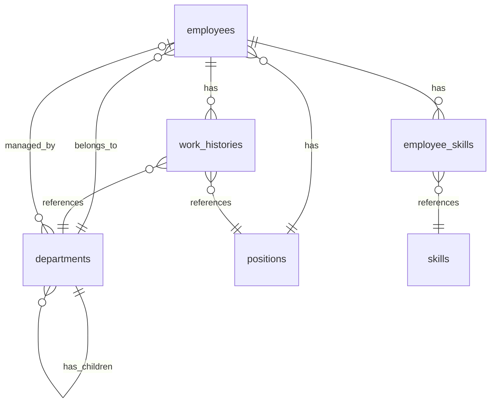

# 社員管理システム (Employee Management System)

## 概要

このシステムは、中規模企業向けの包括的な人事管理システムのリファレンス実装です。社員情報、組織構造、スキル管理を統合的に扱い、現代的なUIとUXを提供します。

### 主な特徴

- **階層的組織管理**: 部署の階層構造を視覚的に表現
- **スキルマトリックス**: 組織全体のスキル分布を多次元で分析
- **リアルタイム統計**: 人事データの即時可視化
- **モック/本番切り替え**: 開発と本番環境の容易な切り替え

## アーキテクチャ

### 技術スタック

- **Frontend**: Svelte 5.16+ (Runes構文)
- **Framework**: SvelteKit 2.16+
- **UI Library**: DaisyUI 5.0.37+ (Tailwind CSS 4.1.7)
- **Language**: TypeScript 5.0.0
- **State Management**: Svelte Stores
- **Data Persistence**: LocalStorage (Mock) / REST API (Production)

### ディレクトリ構造

```
./
├── +page.svelte              # メインエントリーポイント
├── README.md                 # このファイル
├── config.js                 # システム設定・定数定義
├── api/
│   ├── apiService.js         # API通信層（モック/本番切り替え）
│   ├── localStorage.js       # ローカルストレージ操作
│   └── mockData.js          # モックデータ生成
├── stores/
│   ├── employeeStore.js      # 社員データ管理
│   └── uiStore.js           # UI状態管理
├── types/
│   └── database.ts          # データベース型定義
├── EmployeeList.svelte       # 社員一覧
├── EmployeeModal.svelte      # 社員詳細/編集
├── EmployeeFilters.svelte    # 検索・フィルター
├── EmployeeStats.svelte      # 統計表示
├── OrgChart.svelte           # 組織図
├── MatrixView.svelte         # マトリックス表示
└── SkillManagement.svelte   # スキル管理
```

## データベース設計

### ER図概要



### 主要テーブル

#### 1. employees（社員）
```sql
CREATE TABLE employees (
    id UUID PRIMARY KEY DEFAULT gen_random_uuid(),
    employee_number VARCHAR(10) UNIQUE NOT NULL,
    first_name VARCHAR(50) NOT NULL,
    last_name VARCHAR(50) NOT NULL,
    first_name_kana VARCHAR(50) NOT NULL,
    last_name_kana VARCHAR(50) NOT NULL,
    email VARCHAR(255) UNIQUE NOT NULL,
    phone_number VARCHAR(20),
    department_id UUID REFERENCES departments(id),
    position_id UUID REFERENCES positions(id),
    hire_date DATE NOT NULL,
    birth_date DATE,
    avatar_url VARCHAR(500),
    status VARCHAR(20) NOT NULL CHECK (status IN ('active', 'inactive', 'retired')),
    contract_type VARCHAR(20) NOT NULL CHECK (contract_type IN ('fulltime', 'parttime', 'contract', 'intern')),
    salary DECIMAL(10,2),
    work_location VARCHAR(100),
    address TEXT,
    emergency_contact JSONB,
    notes TEXT,
    created_at TIMESTAMP DEFAULT CURRENT_TIMESTAMP,
    updated_at TIMESTAMP DEFAULT CURRENT_TIMESTAMP,
    created_by UUID,
    updated_by UUID,
    
    INDEX idx_employee_number (employee_number),
    INDEX idx_email (email),
    INDEX idx_department_id (department_id),
    INDEX idx_position_id (position_id),
    INDEX idx_status (status),
    INDEX idx_name (last_name, first_name)
);
```

#### 2. departments（部署）
```sql
CREATE TABLE departments (
    id UUID PRIMARY KEY DEFAULT gen_random_uuid(),
    name VARCHAR(100) NOT NULL,
    code VARCHAR(10) UNIQUE NOT NULL,
    description TEXT,
    parent_id UUID REFERENCES departments(id),
    path VARCHAR(500) NOT NULL,
    level INTEGER NOT NULL,
    sort_order INTEGER NOT NULL,
    manager_id UUID REFERENCES employees(id),
    budget DECIMAL(15,2),
    is_active BOOLEAN DEFAULT true,
    created_at TIMESTAMP DEFAULT CURRENT_TIMESTAMP,
    updated_at TIMESTAMP DEFAULT CURRENT_TIMESTAMP,
    
    INDEX idx_code (code),
    INDEX idx_parent_id (parent_id),
    INDEX idx_path (path),
    INDEX idx_manager_id (manager_id)
);
```

#### 3. positions（役職）
```sql
CREATE TABLE positions (
    id UUID PRIMARY KEY DEFAULT gen_random_uuid(),
    name VARCHAR(100) NOT NULL,
    code VARCHAR(10) UNIQUE NOT NULL,
    level INTEGER NOT NULL CHECK (level BETWEEN 1 AND 10),
    description TEXT,
    permissions JSONB,
    salary_range JSONB,
    is_management BOOLEAN DEFAULT false,
    is_active BOOLEAN DEFAULT true,
    created_at TIMESTAMP DEFAULT CURRENT_TIMESTAMP,
    updated_at TIMESTAMP DEFAULT CURRENT_TIMESTAMP,
    
    INDEX idx_code (code),
    INDEX idx_level (level)
);
```

#### 4. skills（スキル）
```sql
CREATE TABLE skills (
    id UUID PRIMARY KEY DEFAULT gen_random_uuid(),
    name VARCHAR(100) NOT NULL,
    category VARCHAR(50) NOT NULL,
    description TEXT,
    level VARCHAR(20),
    color VARCHAR(50),
    is_active BOOLEAN DEFAULT true,
    created_at TIMESTAMP DEFAULT CURRENT_TIMESTAMP,
    updated_at TIMESTAMP DEFAULT CURRENT_TIMESTAMP,
    
    INDEX idx_category (category),
    INDEX idx_name (name)
);
```

#### 5. employee_skills（社員スキル関連）
```sql
CREATE TABLE employee_skills (
    id UUID PRIMARY KEY DEFAULT gen_random_uuid(),
    employee_id UUID NOT NULL REFERENCES employees(id) ON DELETE CASCADE,
    skill_id UUID NOT NULL REFERENCES skills(id),
    level VARCHAR(20) CHECK (level IN ('beginner', 'intermediate', 'advanced', 'expert')),
    certified_date DATE,
    expiry_date DATE,
    notes TEXT,
    created_at TIMESTAMP DEFAULT CURRENT_TIMESTAMP,
    updated_at TIMESTAMP DEFAULT CURRENT_TIMESTAMP,
    
    UNIQUE (employee_id, skill_id),
    INDEX idx_employee_id (employee_id),
    INDEX idx_skill_id (skill_id)
);
```

#### 6. work_histories（職歴）
```sql
CREATE TABLE work_histories (
    id UUID PRIMARY KEY DEFAULT gen_random_uuid(),
    employee_id UUID NOT NULL REFERENCES employees(id) ON DELETE CASCADE,
    department_id UUID NOT NULL REFERENCES departments(id),
    position_id UUID NOT NULL REFERENCES positions(id),
    start_date DATE NOT NULL,
    end_date DATE,
    reason VARCHAR(255),
    notes TEXT,
    created_at TIMESTAMP DEFAULT CURRENT_TIMESTAMP,
    created_by UUID,
    
    INDEX idx_employee_id (employee_id),
    INDEX idx_start_date (start_date),
    INDEX idx_end_date (end_date)
);
```

### インデックス戦略

1. **主キー**: UUIDを使用（分散システムでの競合回避）
2. **ユニーク制約**: employee_number, email, department.code, position.code
3. **外部キー**: 参照整合性の保証
4. **複合インデックス**: (employee_id, skill_id), (last_name, first_name)
5. **検索用インデックス**: status, category, level

## 機能詳細

### 1. 社員一覧（Employee List）

#### 表示モード
- **リストビュー**: 詳細情報を含む表形式
- **グリッドビュー**: カード形式でビジュアル重視

#### フィルタリング機能
- テキスト検索（名前、メール、社員番号）
- 部署フィルター（階層対応）
- 役職フィルター
- スキルフィルター（複数選択可）
- 雇用形態フィルター
- 在籍状況フィルター
- 入社年範囲
- 年齢範囲
- 勤務地

#### ソート機能
- 社員番号
- 氏名（姓名）
- 入社日
- 部署
- 役職レベル

### 2. 組織図（Organization Chart）

#### 表示モード
1. **階層ビュー**: 組織の階層構造を視覚的に表示
2. **部署リスト**: テーブル形式で詳細情報表示
3. **マトリックスビュー**: 多次元分析
   - 部署×スキル
   - 部署×役職
   - スキル×役職

#### 特徴
- 部署の展開/折りたたみ
- 部門長の表示
- 社員数の集計（直属/配下含む）
- インタラクティブな部署選択

### 3. スキル管理（Skill Management）

#### 機能
1. **スキル概要**: 各スキルの保有者数と分布
2. **スキルギャップ分析**: 部署の必要スキルと実際の差分
3. **スキル詳細**: レベル別の社員一覧

#### 分析指標
- スキル保有率
- レベル分布
- 部署別分布
- 平均経験年数

### 4. 統計ダッシュボード

#### 表示項目
- 総社員数/在籍者数
- 平均年齢/勤続年数
- 離職率
- 雇用形態別分布
- 部署別社員数
- 役職別分布
- 人気スキルランキング

## API仕様

### エンドポイント一覧

```javascript
// 社員関連
GET    /api/v1/employees              # 社員一覧
GET    /api/v1/employees/:id          # 社員詳細
POST   /api/v1/employees              # 社員作成
PUT    /api/v1/employees/:id          # 社員更新
DELETE /api/v1/employees/:id          # 社員削除
POST   /api/v1/employees/bulk-delete  # 一括削除

// 社員スキル
GET    /api/v1/employees/:id/skills   # 社員スキル取得
PUT    /api/v1/employees/:id/skills   # 社員スキル更新

// 部署関連
GET    /api/v1/departments            # 部署一覧
GET    /api/v1/departments/:id        # 部署詳細
POST   /api/v1/departments            # 部署作成
PUT    /api/v1/departments/:id        # 部署更新
DELETE /api/v1/departments/:id        # 部署削除

// 役職関連
GET    /api/v1/positions              # 役職一覧
GET    /api/v1/positions/:id          # 役職詳細
POST   /api/v1/positions              # 役職作成
PUT    /api/v1/positions/:id          # 役職更新
DELETE /api/v1/positions/:id          # 役職削除

// スキル関連
GET    /api/v1/skills                 # スキル一覧
GET    /api/v1/skills/:id             # スキル詳細
POST   /api/v1/skills                 # スキル作成
PUT    /api/v1/skills/:id             # スキル更新
DELETE /api/v1/skills/:id             # スキル削除

// 統計関連
GET    /api/v1/statistics             # 統計概要
GET    /api/v1/statistics/skill-gaps  # スキルギャップ分析
GET    /api/v1/statistics/departments # 部署統計
```

### レスポンス形式

```typescript
// 成功レスポンス
{
  "success": true,
  "data": {...},
  "meta": {
    "total": 100,
    "page": 1,
    "pageSize": 20
  }
}

// エラーレスポンス
{
  "success": false,
  "error": {
    "code": "VALIDATION_ERROR",
    "message": "入力値が不正です",
    "details": {...}
  }
}
```

## 状態管理

### Svelteストア構成

1. **employeeStore.js**
   - 社員データの管理
   - フィルタリング・ソート
   - 派生データ（統計、グループ化）

2. **uiStore.js**
   - モーダルの開閉状態
   - 選択状態
   - 通知管理
   - ビューモード

### データフロー

```
API/LocalStorage
    ↓
apiService.js (データ取得層)
    ↓
employeeStore.js (状態管理)
    ↓
Components (UI表示)
    ↓
User Actions
    ↓
apiService.js (データ更新)
```

## カスタマイズガイド

### 1. 新しいフィールドの追加

社員に新しいフィールド（例：血液型）を追加する場合：

```javascript
// 1. types/database.tsに型を追加
export interface Employee {
  // ... 既存フィールド
  blood_type?: 'A' | 'B' | 'O' | 'AB'; // 新規追加
}

// 2. モックデータ生成に追加（mockData.js）
const bloodTypes = ['A', 'B', 'O', 'AB'];
employees.push({
  // ... 既存データ
  blood_type: bloodTypes[Math.floor(Math.random() * bloodTypes.length)]
});

// 3. フォームに入力フィールドを追加（EmployeeModal.svelte）
<select class="select select-bordered" bind:value={formData.blood_type}>
  <option value="">選択してください</option>
  <option value="A">A型</option>
  <option value="B">B型</option>
  <option value="O">O型</option>
  <option value="AB">AB型</option>
</select>
```

### 2. 新しいビューの追加

新しい表示モード（例：タイムライン表示）を追加する場合：

```javascript
// 1. viewModeに新しいモードを追加
let viewMode = 'list' | 'grid' | 'org_chart' | 'skill_matrix' | 'timeline';

// 2. タブに追加
<button 
  class="tab {$viewMode === 'timeline' ? 'tab-active' : ''}"
  on:click={() => handleViewModeChange('timeline')}
>
  タイムライン
</button>

// 3. コンポーネントを作成して表示
{:else if $viewMode === 'timeline'}
  <TimelineView />
{/if}
```

### 3. フィルターの追加

新しいフィルター条件を追加する場合：

```javascript
// 1. フィルター状態に追加（employeeStore.js）
export const filters = writable({
  // ... 既存フィルター
  bloodType: [] // 新規追加
});

// 2. フィルタリングロジックに追加
if ($filters.bloodType?.length > 0) {
  filtered = filtered.filter(emp => 
    $filters.bloodType.includes(emp.blood_type)
  );
}

// 3. UIに追加（EmployeeFilters.svelte）
<select multiple bind:value={$filters.bloodType}>
  <option value="A">A型</option>
  <option value="B">B型</option>
  <option value="O">O型</option>
  <option value="AB">AB型</option>
</select>
```

### 4. APIの本番実装

モックから本番APIに切り替える場合：

```javascript
// apiService.jsのapiRequest関数を実装
async function apiRequest(method, endpoint, data = null, params = {}) {
  if (CONFIG.IS_MOCK_MODE) {
    return mockApiRequest(method, endpoint, data, params);
  }
  
  // 本番実装
  const url = `${CONFIG.API.BASE_URL}${endpoint}`;
  const response = await fetch(url, {
    method,
    headers: {
      'Content-Type': 'application/json',
      'Authorization': `Bearer ${getAuthToken()}`
    },
    body: data ? JSON.stringify(data) : null
  });
  
  if (!response.ok) {
    throw new ApiError(response.status, await response.text());
  }
  
  return await response.json();
}
```

### 5. 権限管理の実装

役職に基づく権限制御を追加：

```javascript
// 1. 権限チェック関数を作成
function hasPermission(employee, permission) {
  const position = positionMap.get(employee.position_id);
  return position?.permissions?.includes(permission);
}

// 2. UIで権限チェック
{#if hasPermission(currentUser, 'employee:write')}
  <button on:click={handleEdit}>編集</button>
{/if}
```

## パフォーマンス最適化

### 1. 大量データの扱い

```javascript
// 仮想スクロールの実装
import VirtualList from '@tanstack/svelte-virtual';

<VirtualList
  data={filteredEmployees}
  estimateSize={() => 60}
  renderItem={({ item }) => <EmployeeRow employee={item} />}
/>
```

### 2. 検索の最適化

```javascript
// デバウンス処理
import { debounce } from 'lodash-es';

const debouncedSearch = debounce((searchTerm) => {
  updateFilter('search', searchTerm);
}, 300);

// メモ化
const searchResults = derived(
  [employees, searchTerm],
  ([$employees, $searchTerm]) => {
    // 重い検索処理
    return memoizedSearch($employees, $searchTerm);
  }
);
```

### 3. 画像の遅延読み込み

```javascript
// Intersection Observer を使用

```

## トラブルシューティング

### よくある問題と解決策

#### 1. データが表示されない
- LocalStorageのデータを確認: `localStorage.getItem('hr_employees')`
- データリセット: 統計パネルの「データをリセット」ボタンを使用
- コンソールエラーを確認

#### 2. フィルターが機能しない
- フィルター状態を確認: `$filters`をログ出力
- インデックスが正しく設定されているか確認
- 大文字小文字の区別に注意

#### 3. モーダルが開かない
- UIストアの状態を確認: `$modalState`
- イベントハンドラーが正しくバインドされているか確認

#### 4. パフォーマンスが遅い
- 開発者ツールでプロファイリング
- 不要な再レンダリングを確認
- derivedストアの依存関係を最小化

## セキュリティ考慮事項

### 1. データの機密性
- 給与情報のマスキング: `CONFIG.SECURITY.MASK_SALARY`
- 個人情報の保護: 適切な権限チェック
- ログイン認証の実装

### 2. 入力検証
- XSS対策: HTMLエスケープ
- SQLインジェクション対策: パラメータバインディング
- CSRFトークンの実装

### 3. 通信の暗号化
- HTTPS必須
- APIキーの安全な管理
- セッション管理

## 開発Tips

### 1. Svelte 5の注意点

```javascript
// ❌ 古い書き方（Svelte 4）
export let value;
$: doubled = value * 2;

// ✅ 新しい書き方（Svelte 5）
let { value } = $props();
const doubled = $derived(value * 2);
```

### 2. リアクティビティの落とし穴

```javascript
// ❌ 配列の破壊的変更（UIが更新されない）
items.push(newItem);

// ✅ 新しい配列を作成
items = [...items, newItem];
```

### 3. ストアの適切な使用

```javascript
// ❌ コンポーネント内で直接ストアを変更
$employees[0].name = 'New Name';

// ✅ ストアのメソッドを使用
updateEmployee(employeeId, { name: 'New Name' });
```

### 4. TypeScriptの活用

```typescript
// 型の再利用
type EmployeeWithDetails = Employee & {
  department_name: string;
  position_name: string;
};

// 型ガード
function isEmployee(data: unknown): data is Employee {
  return (
    typeof data === 'object' &&
    data !== null &&
    'employee_number' in data
  );
}
```

## テスト戦略

### 1. ユニットテスト

```javascript
// Vitest を使用
import { describe, it, expect } from 'vitest';
import { sortEmployeesByPosition } from './utils';

describe('sortEmployeesByPosition', () => {
  it('should sort by position level', () => {
    const result = sortEmployeesByPosition(employees);
    expect(result[0].position_level).toBeGreaterThan(result[1].position_level);
  });
});
```

### 2. コンポーネントテスト

```javascript
// Testing Library を使用
import { render, fireEvent } from '@testing-library/svelte';
import EmployeeList from './EmployeeList.svelte';

test('should filter employees', async () => {
  const { getByLabelText, queryByText } = render(EmployeeList);
  const searchInput = getByLabelText('検索');
  
  await fireEvent.input(searchInput, { target: { value: '田中' } });
  expect(queryByText('田中太郎')).toBeInTheDocument();
});
```

### 3. E2Eテスト

```javascript
// Playwright を使用
test('complete employee registration flow', async ({ page }) => {
  await page.goto(PATH);
  await page.click('text=新規登録');
  await page.fill('[name=first_name]', '太郎');
  await page.fill('[name=last_name]', '山田');
  await page.click('text=保存');
  
  await expect(page.locator('text=山田太郎')).toBeVisible();
});
```

## 今後の拡張案

1. **リアルタイム同期**: WebSocketを使用した複数ユーザー間の同期
2. **承認ワークフロー**: 人事異動や昇進の承認プロセス
3. **レポート機能**: PDF/Excel出力、定期レポート生成
4. **モバイルアプリ**: React Native/Flutter での実装
5. **AI機能**: スキルマッチング、キャリアパス提案
6. **外部連携**: 勤怠システム、給与システムとの統合
7. **多言語対応**: i18n実装による国際化

## 参考資料

- [Svelte 5 Documentation](https://svelte.dev/docs)
- [SvelteKit Documentation](https://kit.svelte.dev/docs)
- [DaisyUI Components](https://daisyui.com/components/)
- [TypeScript Handbook](https://www.typescriptlang.org/docs/)
- [PostgreSQL Documentation](https://www.postgresql.org/docs/)

## ライセンス

このプロジェクトはサンプル実装であり、自由に参考・改変していただけます。