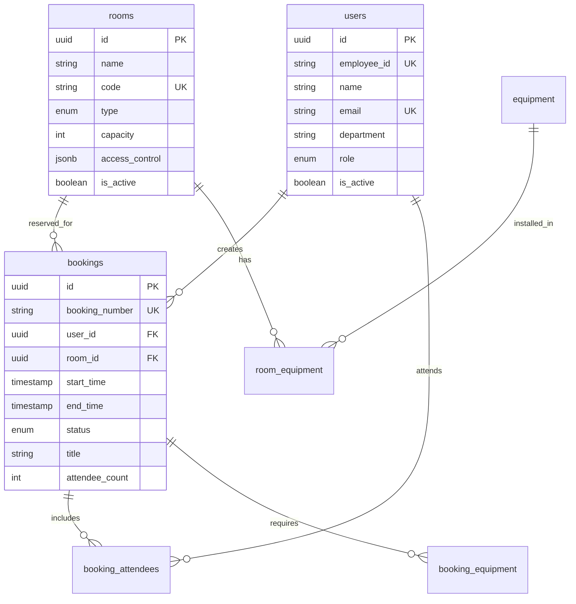

# 会議室予約システム - AI駆動開発ガイド

## 概要

このドキュメントは、会議室予約システムをAIの力を活用して拡張・改善する際の包括的なガイドです。
モックモードと本番モードの切り替え、RDBスキーマ設計、API抽象化層の実装パターンを詳細に記載しています。

## システムアーキテクチャ

### レイヤー構成

```
┌─────────────────────────────────────────────────────┐
│                  UI層 (Svelte Components)            │
├─────────────────────────────────────────────────────┤
│                 Store層 (Svelte Stores)              │
├─────────────────────────────────────────────────────┤
│           API Service層 (Interface + Factory)        │
├─────────────────────────────────────────────────────┤
│     Mock Service  │  Production Service (本実装時)   │
├─────────────────────────────────────────────────────┤
│   LocalStorage    │    REST API / GraphQL           │
└─────────────────────────────────────────────────────┘
```

### モック/本番切り替えアーキテクチャ

```typescript
// config.ts の isMockMode フラグで制御
export const CONFIG = {
  isMockMode: true, // false で本番モード
  // ...
};

// apiServiceFactory.ts が実装を切り替え
function createApiService(): IMeetingRoomApiService {
  if (CONFIG.isMockMode) {
    return new MockMeetingRoomApiClient();
  } else {
    return new ProductionMeetingRoomApiClient();
  }
}
```

## データベース設計

### ER図（主要エンティティ）



### 主要テーブル一覧

| テーブル名 | 説明 | 主要カラム | インデックス戦略 |
|-----------|------|-----------|-----------------|
| users | ユーザー情報 | id, employee_id, email, department, role | employee_id (UNIQUE), email (UNIQUE), department |
| rooms | 会議室マスタ | id, code, type, capacity, floor | code (UNIQUE), type, capacity, floor |
| bookings | 予約情報 | id, booking_number, user_id, room_id, start_time, end_time | booking_number (UNIQUE), user_id, room_id, (start_time, end_time) |
| equipment | 設備マスタ | id, name, type | type |
| room_equipment | 会議室設備関連 | room_id, equipment_id | (room_id, equipment_id) PRIMARY KEY |
| booking_attendees | 予約参加者 | id, booking_id, user_id | booking_id, user_id |

### パフォーマンス最適化

```sql
-- 複合インデックス（頻繁な検索条件）
CREATE INDEX idx_bookings_room_date ON bookings(room_id, start_time, end_time);
CREATE INDEX idx_bookings_user_status ON bookings(user_id, status);

-- 部分インデックス（アクティブな予約のみ）
CREATE INDEX idx_bookings_active ON bookings(start_time, end_time) 
    WHERE status IN ('confirmed', 'pending');

-- 全文検索インデックス
CREATE INDEX idx_bookings_fts ON bookings 
    USING gin(to_tsvector('japanese', title || ' ' || description));
```

## API設計パターン

### インターフェース定義（apiService.interface.ts）

```typescript
export interface IMeetingRoomApiService {
  // 基本的なCRUD操作
  getBookings(params?: BookingQueryParams): Promise<Booking[]>;
  createBooking(booking: CreateBookingDto): Promise<Booking>;
  updateBooking(id: string, updates: UpdateBookingDto): Promise<Booking>;
  deleteBooking(id: string): Promise<void>;
  
  // ビジネスロジック
  searchAvailableRooms(params: RoomSearchParams): Promise<RoomAvailability[]>;
  checkBookingConflict(params: ConflictCheckParams): Promise<ConflictCheck>;
  
  // 統計・分析
  getUsageStats(params: UsageStatsParams): Promise<UsageStats>;
  getRoomAnalytics(params: RoomAnalyticsParams): Promise<RoomAnalytics>;
}
```

### モックサービス実装パターン

```typescript
class MockMeetingRoomApiService implements IMeetingRoomApiService {
  private storage = new LocalStorageAdapter();
  
  async getBookings(params?: BookingQueryParams): Promise<Booking[]> {
    // LocalStorageから取得
    let bookings = await this.storage.get<Booking[]>('bookings') || [];
    
    // フィルタリング
    if (params?.startDate) {
      bookings = bookings.filter(b => b.startTime >= params.startDate);
    }
    
    // ページング
    if (params?.page && params?.limit) {
      const start = (params.page - 1) * params.limit;
      bookings = bookings.slice(start, start + params.limit);
    }
    
    return bookings;
  }
}
```

### 本番サービス実装パターン

```typescript
class ProductionMeetingRoomApiService implements IMeetingRoomApiService {
  private apiClient = new HttpClient(CONFIG.api.baseUrl);
  
  async getBookings(params?: BookingQueryParams): Promise<Booking[]> {
    const response = await this.apiClient.get<ApiResponse<Booking[]>>(
      '/api/bookings',
      { params }
    );
    
    // エラーハンドリング
    if (!response.ok) {
      throw new ApiError(response.error);
    }
    
    // データ変換（必要に応じて）
    return response.data.map(this.transformBooking);
  }
  
  private transformBooking(raw: any): Booking {
    // APIレスポンスをアプリケーションモデルに変換
    return {
      ...raw,
      startTime: new Date(raw.start_time).toISOString(),
      endTime: new Date(raw.end_time).toISOString(),
    };
  }
}
```

## 機能実装ガイド

### 1. 予約作成フロー

```typescript
// 1. 空き状況確認
const availability = await apiService.searchAvailableRooms({
  startTime: selectedDateTime,
  endTime: calculateEndTime(selectedDateTime, duration),
  attendeeCount: attendeeCount,
  requiredEquipment: selectedEquipment
});

// 2. 競合チェック
const conflictCheck = await apiService.checkBookingConflict({
  roomId: selectedRoom.id,
  startTime: selectedDateTime,
  endTime: endTime
});

if (conflictCheck.hasConflict) {
  // 代替案を提示
  showAlternatives(conflictCheck.suggestions);
  return;
}

// 3. 予約作成
const booking = await apiService.createBooking({
  roomId: selectedRoom.id,
  startTime: selectedDateTime,
  endTime: endTime,
  title: title,
  attendeeCount: attendeeCount,
  type: 'meeting'
});

// 4. 通知設定
if (reminderEnabled) {
  await apiService.updateNotificationSettings(booking.id, {
    email15min: true,
    slackNotification: true
  });
}
```

### 2. リアルタイム空き状況表示

```typescript
// ストアでリアクティブな状態管理
export const roomAvailability = derived(
  [selectedDate, rooms, bookings],
  ([$date, $rooms, $bookings]) => {
    return $rooms.map(room => {
      const dayBookings = $bookings.filter(b => 
        b.roomId === room.id && 
        isSameDay(b.startTime, $date)
      );
      
      const slots = generateTimeSlots($date);
      const availability = slots.map(slot => ({
        time: slot,
        available: !hasConflict(slot, dayBookings)
      }));
      
      return { room, availability };
    });
  }
);
```

### 3. 統計ダッシュボード

```typescript
// 部署別利用統計の取得
export const departmentStats = derived(
  [bookings, users],
  ([$bookings, $users]) => {
    const stats = new Map<string, DepartmentStat>();
    
    $bookings.forEach(booking => {
      const user = $users.find(u => u.id === booking.userId);
      if (!user) return;
      
      const stat = stats.get(user.department) || {
        department: user.department,
        bookingCount: 0,
        totalHours: 0,
        uniqueUsers: new Set()
      };
      
      stat.bookingCount++;
      stat.totalHours += calculateDuration(booking);
      stat.uniqueUsers.add(user.id);
      
      stats.set(user.department, stat);
    });
    
    return Array.from(stats.values());
  }
);
```

## カスタマイズポイント

### 1. 新しい予約タイプの追加

```typescript
// 1. 型定義の更新 (types/index.ts)
export type BookingType = 'meeting' | 'presentation' | 'training' | 'interview' | 'workshop' | 'other';

// 2. DB制約の更新 (database-schema.sql)
ALTER TABLE bookings DROP CONSTRAINT bookings_type_check;
ALTER TABLE bookings ADD CONSTRAINT bookings_type_check 
  CHECK (type IN ('meeting', 'presentation', 'training', 'interview', 'workshop', 'other'));

// 3. UIの更新 (BookingForm.svelte)
const bookingTypes = [
  { value: 'meeting', label: '会議', icon: '💼', defaultDuration: 60 },
  { value: 'presentation', label: 'プレゼン', icon: '📊', defaultDuration: 120 },
  { value: 'workshop', label: 'ワークショップ', icon: '🎯', defaultDuration: 180 },
  // ...
];
```

### 2. カスタム承認フローの実装

```typescript
// 承認ルールの定義
interface ApprovalRule {
  condition: (booking: Booking, room: Room) => boolean;
  approvers: string[]; // 承認者のrole or userId
  escalationHours?: number;
}

const approvalRules: ApprovalRule[] = [
  {
    // 大会議室の予約は管理者承認必須
    condition: (booking, room) => room.capacity > 20,
    approvers: ['admin', 'manager'],
    escalationHours: 24
  },
  {
    // 外部ゲスト参加時は部門長承認
    condition: (booking) => booking.externalAttendees?.length > 0,
    approvers: ['department_head']
  }
];

// 承認フロー実行
async function processApproval(booking: Booking): Promise<void> {
  const room = await apiService.getRoom(booking.roomId);
  const applicableRules = approvalRules.filter(rule => 
    rule.condition(booking, room)
  );
  
  if (applicableRules.length === 0) {
    // 承認不要、自動確定
    await apiService.updateBooking(booking.id, { status: 'confirmed' });
    return;
  }
  
  // 承認リクエスト作成
  for (const rule of applicableRules) {
    await createApprovalRequest(booking, rule);
  }
}
```

### 3. 外部カレンダー連携

```typescript
// Google Calendar連携の例
class GoogleCalendarAdapter {
  async syncBooking(booking: Booking): Promise<void> {
    const event = {
      summary: booking.title,
      location: `${booking.roomName} (${booking.roomCode})`,
      description: booking.description,
      start: {
        dateTime: booking.startTime,
        timeZone: CONFIG.system.timezone
      },
      end: {
        dateTime: booking.endTime,
        timeZone: CONFIG.system.timezone
      },
      attendees: booking.attendees?.map(a => ({ email: a.email }))
    };
    
    await gapi.client.calendar.events.insert({
      calendarId: 'primary',
      resource: event
    });
  }
}
```

## テスト戦略

### 1. ユニットテスト

```typescript
// stores/bookingStore.test.ts
describe('BookingStore', () => {
  let mockApiService: MockMeetingRoomApiService;
  
  beforeEach(() => {
    mockApiService = new MockMeetingRoomApiService();
    setMeetingRoomApiService(mockApiService);
  });
  
  test('予約作成時の競合チェック', async () => {
    // 既存予約を設定
    await mockApiService.createBooking({
      roomId: 'room1',
      startTime: '2024-01-01T10:00:00',
      endTime: '2024-01-01T11:00:00',
      // ...
    });
    
    // 競合する予約を作成試行
    const result = await createBooking({
      roomId: 'room1',
      startTime: '2024-01-01T10:30:00',
      endTime: '2024-01-01T11:30:00',
      // ...
    });
    
    expect(result).toBeNull();
    expect(get(error)).toContain('既に予約されています');
  });
});
```

### 2. 統合テスト

```typescript
// e2e/booking-flow.test.ts
test('予約作成フロー全体', async ({ page }) => {
  await page.goto('/meeting-rooms');
  
  // クイック予約を開く
  await page.click('text=新規予約');
  
  // 日時を選択
  await page.click('text=日時から選択');
  await page.fill('input[type="date"]', '2024-01-01');
  await page.selectOption('select[name="time"]', '10:00');
  
  // 会議室を検索
  await page.click('text=会議室を検索');
  
  // 結果から選択
  await page.click('.room-card:first-child');
  
  // 詳細入力
  await page.fill('input[name="title"]', 'テスト会議');
  await page.fill('input[name="attendeeCount"]', '5');
  
  // 予約確定
  await page.click('text=予約する');
  
  // 成功メッセージを確認
  await expect(page.locator('.alert-success')).toContainText('予約が完了しました');
});
```

## 運用・監視

### ログ設計

```typescript
// 構造化ログの実装
class Logger {
  info(message: string, context?: any) {
    console.log(JSON.stringify({
      timestamp: new Date().toISOString(),
      level: 'INFO',
      message,
      ...context
    }));
  }
  
  error(message: string, error: Error, context?: any) {
    console.error(JSON.stringify({
      timestamp: new Date().toISOString(),
      level: 'ERROR',
      message,
      error: {
        name: error.name,
        message: error.message,
        stack: error.stack
      },
      ...context
    }));
  }
}

// 使用例
logger.info('予約作成', {
  userId: booking.userId,
  roomId: booking.roomId,
  duration: calculateDuration(booking),
  type: booking.type
});
```

### メトリクス収集

```typescript
// 主要メトリクス
interface SystemMetrics {
  // 利用状況
  totalBookings: number;
  activeBookings: number;
  utilizationRate: number;
  
  // パフォーマンス
  avgResponseTime: number;
  errorRate: number;
  
  // ビジネス指標
  avgBookingDuration: number;
  peakHours: string[];
  popularRooms: string[];
}

// メトリクス収集サービス
class MetricsCollector {
  async collectDailyMetrics(): Promise<SystemMetrics> {
    const [bookings, rooms, performanceData] = await Promise.all([
      apiService.getBookings({ date: today }),
      apiService.getRooms(),
      getPerformanceMetrics()
    ]);
    
    return calculateMetrics(bookings, rooms, performanceData);
  }
}
```

## 関連ドキュメント

- [基本README](./README.md) - システムの基本的な使い方
- [データベース設計](./database-schema.sql) - 詳細なスキーマ定義
- [API仕様書](./docs/api-specification.md) - REST APIの詳細仕様
- [UI/UXガイドライン](./docs/ui-guidelines.md) - デザイン原則とコンポーネント

## 本実装時のチェックリスト

### Phase 1: 基盤整備
- [ ] 本番用データベースのセットアップ
- [ ] 認証・認可システムの実装
- [ ] APIサーバーの構築
- [ ] エラーハンドリングとログシステム

### Phase 2: 機能実装
- [ ] 基本的なCRUD操作の実装
- [ ] リアルタイム更新（WebSocket/SSE）
- [ ] 通知システム（メール/Slack）
- [ ] 外部カレンダー連携

### Phase 3: 運用準備
- [ ] バックアップ・リストア手順
- [ ] 監視・アラート設定
- [ ] パフォーマンステスト
- [ ] セキュリティ監査

## まとめ

このシステムは、モックモードで完全に動作するプロトタイプとして実装されていますが、
本番環境への移行を前提とした設計になっています。

AI駆動開発を行う際は、以下の点に注意してください：

1. **型安全性の維持**: TypeScriptの型定義を必ず更新する
2. **モック/本番の分離**: 常にインターフェースを通じてアクセスする
3. **段階的な移行**: 機能ごとに本番実装に切り替えられる設計
4. **テストカバレッジ**: モックモードでのテストを本番でも活用

このドキュメントを参考に、効率的で保守性の高いシステム開発を実現してください。