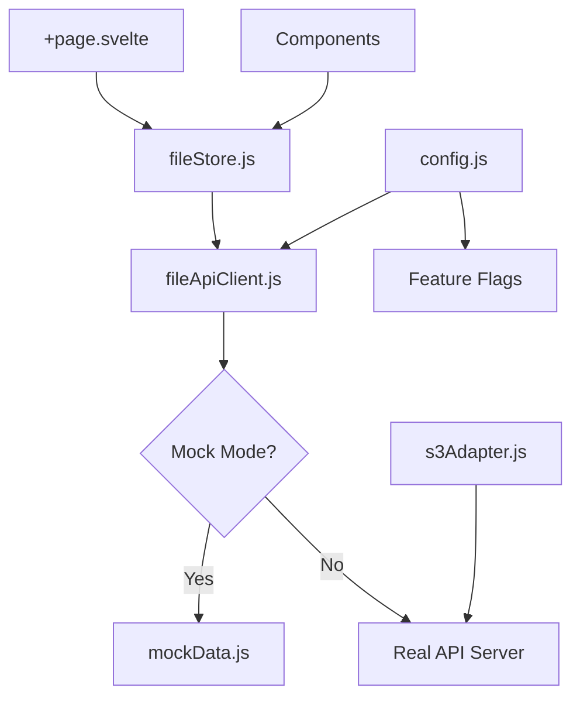

# ファイル管理システム

本格的なファイル管理システムのリファレンス実装です。Google Driveライクなインターフェースを提供し、S3互換ストレージとの統合を前提とした設計になっています。

## 📁 ディレクトリ構成

```
src/routes/sample/file-explorer/
├── +page.svelte                 # メインページコンポーネント
├── README.md                   # 本ドキュメント
├── config.js                   # 設定管理
├── fileStore.js                # 中央ストア（状態管理）
├── api/
│   ├── fileClient.js           # APIクライアント抽象化レイヤー
│   └── mockData.js             # モックデータ（RDB構造対応）
├── components/
│   ├── CreateFolderModal.svelte # フォルダ作成モーダル
│   ├── DeleteConfirmModal.svelte # 削除確認モーダル
│   ├── FileList.svelte         # ファイル一覧表示
│   ├── FilePreviewModal.svelte # ファイルプレビュー
│   ├── FileUploadModal.svelte  # ファイルアップロード
│   ├── FolderTree.svelte       # フォルダツリー
│   ├── RenameModal.svelte      # リネームモーダル
│   └── Toolbar.svelte          # ツールバー
└── s3Adapter.js                # S3アダプター（将来実装用）
```

## 🚀 主要機能

### ✅ 実装済み機能

- **ファイル・フォルダ操作**
  - ✅ ファイル/フォルダの作成、削除、リネーム
  - ✅ ドラッグ&ドロップでのファイルアップロード
  - ✅ ドラッグ&ドロップでのファイル移動
  - ✅ 複数選択による一括操作
  - ✅ フォルダのスター機能

- **表示・ナビゲーション**
  - ✅ グリッド表示/リスト表示の切り替え
  - ✅ ファイル名・日付・サイズでのソート
  - ✅ パンくずナビゲーション
  - ✅ 左サイドバーのフォルダツリー
  - ✅ リアルタイム検索

- **ファイル管理**
  - ✅ ファイルタイプ別アイコン表示
  - ✅ ファイルサイズの自動フォーマット
  - ✅ 最終更新日時の表示
  - ✅ ストレージ使用量の可視化

- **ダウンロード機能**
  - ✅ 個別ファイルダウンロード
  - ✅ フォルダのZIP形式ダウンロード
  - ✅ 複数選択時の一括ダウンロード

### 📋 設計済み機能（実装待ち）

- **権限管理**
  - 🔲 ユーザー・組織ベースの権限制御
  - 🔲 読み取り/書き込み/管理者権限
  - 🔲 ファイル共有機能
  - 🔲 招待リンク生成

- **高度な機能**
  - 🔲 バージョン履歴管理
  - 🔲 ファイルプレビュー（PDF, 画像, テキスト）
  - 🔲 全文検索（Elasticsearch連携）
  - 🔲 タグ機能

## 🏗️ アーキテクチャ

### システム構成



### データフロー

1. **UI操作** → コンポーネント
2. **コンポーネント** → fileStore（状態管理）
3. **fileStore** → fileApiClient（API抽象化）
4. **fileApiClient** → Mock/Real API（環境に応じて分岐）

### 状態管理

- **Svelte Store**による中央集権的状態管理
- **楽観的更新**でUXを向上
- **イミュータブル更新**でSvelte 5のリアクティビティに対応

## 🔧 設定とカスタマイズ

### 環境変数

```bash
# モックモードの制御（開発時：true、本番時：false）
VITE_FILE_EXPLORER_MOCK_MODE=true

# APIエンドポイント
VITE_API_BASE_URL=https://api.example.com
```

### config.js の設定項目

```javascript
export const config = {
  // モックモードフラグ
  isMockMode: import.meta.env.VITE_FILE_EXPLORER_MOCK_MODE !== 'false',
  
  // APIエンドポイント
  apiBaseUrl: import.meta.env.VITE_API_BASE_URL || '/api',
  
  // ストレージ制限
  storage: {
    maxFileSize: 100 * 1024 * 1024,    // 100MB
    maxTotalSize: 10 * 1024 * 1024 * 1024, // 10GB
    allowedFileTypes: '*',              // 全て許可
  },
  
  // UI設定
  ui: {
    defaultViewMode: 'grid',            // grid | list
    defaultSortBy: 'name',             // name | date | size
    itemsPerPage: 50,
    enableDragAndDrop: true,
    enableMultiSelect: true,
    enablePreview: true,
  },
  
  // 機能フラグ
  features: {
    enableUpload: true,
    enableDownload: true,
    enableDelete: true,
    enableRename: true,
    enableCreateFolder: true,
    enableMove: true,
    enableShare: true,
    enableStarred: true,
    enableSearch: true,
  }
};
```

## 💾 データベース設計

### テーブル構造（PostgreSQL例）

```sql
-- ファイル・フォルダ管理
CREATE TABLE files (
  id UUID PRIMARY KEY DEFAULT gen_random_uuid(),
  name VARCHAR(255) NOT NULL,
  type VARCHAR(10) NOT NULL CHECK (type IN ('file', 'folder')),
  path TEXT NOT NULL UNIQUE,
  size BIGINT,
  mime_type VARCHAR(255),
  etag VARCHAR(255),
  starred BOOLEAN DEFAULT FALSE,
  shared BOOLEAN DEFAULT FALSE,
  
  -- 関係性
  parent_id UUID REFERENCES files(id) ON DELETE CASCADE,
  organization_id UUID NOT NULL REFERENCES organizations(id),
  
  -- メタデータ
  created_at TIMESTAMP WITH TIME ZONE DEFAULT NOW(),
  updated_at TIMESTAMP WITH TIME ZONE DEFAULT NOW(),
  created_by UUID NOT NULL REFERENCES users(id),
  modified_by UUID NOT NULL REFERENCES users(id),
  
  -- インデックス
  INDEX idx_files_path (path),
  INDEX idx_files_parent_id (parent_id),
  INDEX idx_files_organization_id (organization_id),
  INDEX idx_files_type (type),
  INDEX idx_files_starred (starred) WHERE starred = TRUE
);

-- ファイル権限管理
CREATE TABLE file_permissions (
  id UUID PRIMARY KEY DEFAULT gen_random_uuid(),
  file_id UUID NOT NULL REFERENCES files(id) ON DELETE CASCADE,
  user_id UUID REFERENCES users(id) ON DELETE CASCADE,
  role_id UUID REFERENCES roles(id) ON DELETE CASCADE,
  permission VARCHAR(20) NOT NULL CHECK (permission IN ('read', 'write', 'admin')),
  granted_by UUID NOT NULL REFERENCES users(id),
  created_at TIMESTAMP WITH TIME ZONE DEFAULT NOW(),
  
  -- 複合ユニーク制約
  UNIQUE(file_id, user_id),
  UNIQUE(file_id, role_id)
);

-- ユーザー管理
CREATE TABLE users (
  id UUID PRIMARY KEY DEFAULT gen_random_uuid(),
  email VARCHAR(255) UNIQUE NOT NULL,
  name VARCHAR(255) NOT NULL,
  role VARCHAR(50) NOT NULL DEFAULT 'user',
  organization_id UUID NOT NULL REFERENCES organizations(id),
  created_at TIMESTAMP WITH TIME ZONE DEFAULT NOW(),
  updated_at TIMESTAMP WITH TIME ZONE DEFAULT NOW()
);

-- 組織管理
CREATE TABLE organizations (
  id UUID PRIMARY KEY DEFAULT gen_random_uuid(),
  name VARCHAR(255) NOT NULL,
  plan VARCHAR(50) NOT NULL DEFAULT 'basic',
  storage_limit BIGINT NOT NULL DEFAULT 5368709120, -- 5GB
  created_at TIMESTAMP WITH TIME ZONE DEFAULT NOW(),
  updated_at TIMESTAMP WITH TIME ZONE DEFAULT NOW()
);
```

### インデックス戦略

```sql
-- パフォーマンス最適化用インデックス
CREATE INDEX CONCURRENTLY idx_files_search ON files 
USING GIN (to_tsvector('japanese', name));

CREATE INDEX CONCURRENTLY idx_files_recent ON files (updated_at DESC)
WHERE type = 'file';

CREATE INDEX CONCURRENTLY idx_files_large ON files (size DESC)
WHERE size > 0;
```

## 🔌 API仕様

### RESTful API エンドポイント

```http
# ファイル一覧取得
GET /api/files?path=/Documents&search=query&sort=name&page=1&limit=50

# ファイル/フォルダ作成
POST /api/files
Content-Type: multipart/form-data
{
  "name": "document.pdf",
  "type": "file",
  "parentPath": "/Documents",
  "file": [Binary Data]
}

# ファイル/フォルダ更新
PATCH /api/files/{id}
{
  "name": "new-name.pdf",
  "starred": true,
  "path": "/NewFolder/new-name.pdf"
}

# ファイル/フォルダ削除
DELETE /api/files/batch
{
  "ids": ["uuid1", "uuid2", "uuid3"]
}

# ファイルダウンロード
GET /api/files/{id}/download

# フォルダZIPダウンロード
GET /api/folders/{id}/download-zip

# ストレージ使用量取得
GET /api/storage/info
```

### API レスポンス例

```json
{
  "success": true,
  "data": {
    "items": [
      {
        "id": "550e8400-e29b-41d4-a716-446655440000",
        "name": "契約書_2024.pdf",
        "type": "file",
        "path": "/Documents/契約書_2024.pdf",
        "size": 2458624,
        "mimeType": "application/pdf",
        "starred": false,
        "shared": false,
        "created": "2024-01-15T10:20:00Z",
        "modified": "2024-01-15T10:20:00Z",
        "owner": {
          "id": "user_001",
          "name": "管理者",
          "email": "user@example.com"
        },
        "permissions": "owner"
      }
    ],
    "total": 15,
    "hasMore": false
  }
}
```

## 🔧 開発ガイド

### セットアップ

```bash
# 依存関係のインストール
pnpm install

# 開発サーバー起動
pnpm run dev

# 型チェック
pnpm run check

# ビルド
pnpm run build
```

### モード切り替え

```bash
# 開発時（モックモード）
export VITE_FILE_EXPLORER_MOCK_MODE=true

# 本番時（実APIモード）
export VITE_FILE_EXPLORER_MOCK_MODE=false
export VITE_API_BASE_URL=https://api.example.com
```

### 新機能追加の手順

1. **mockData.js**にテストデータを追加
2. **fileClient.js**のモック実装を更新
3. **fileStore.js**にStoreメソッドを追加
4. **コンポーネント**でUIを実装
5. **本番API**の実装（fileClient.js）

### コンポーネント設計パターン

```svelte
<script>
  import { fileStore } from '../fileStore.js';
  
  // Props（Svelte 5）
  let { data = [], onUpdate = () => {} } = $props();
  
  // 状態管理
  let loading = $state(false);
  let error = $state('');
  
  // リアクティブ計算
  const processedData = $derived(
    data.filter(item => item.active)
  );
  
  // 非同期処理
  async function handleAction() {
    if (loading) return;
    
    loading = true;
    error = '';
    
    try {
      await fileStore.someAction();
      onUpdate();
    } catch (e) {
      error = 'エラーが発生しました';
    } finally {
      loading = false;
    }
  }
</script>
```

### S3連携の実装例

```javascript
// s3Adapter.js
import AWS from 'aws-sdk';

class S3Adapter {
  constructor() {
    this.s3 = new AWS.S3({
      accessKeyId: process.env.AWS_ACCESS_KEY_ID,
      secretAccessKey: process.env.AWS_SECRET_ACCESS_KEY,
      region: process.env.AWS_REGION
    });
    this.bucket = process.env.S3_BUCKET_NAME;
  }

  async uploadFile(file, path) {
    const params = {
      Bucket: this.bucket,
      Key: path,
      Body: file,
      ContentType: file.type,
      Metadata: {
        'original-name': file.name,
        'upload-time': new Date().toISOString()
      }
    };
    
    return this.s3.upload(params).promise();
  }

  async downloadFile(path) {
    const params = {
      Bucket: this.bucket,
      Key: path
    };
    
    return this.s3.getObject(params).promise();
  }

  async deleteFile(path) {
    const params = {
      Bucket: this.bucket,
      Key: path
    };
    
    return this.s3.deleteObject(params).promise();
  }

  async listFiles(prefix = '') {
    const params = {
      Bucket: this.bucket,
      Prefix: prefix,
      Delimiter: '/'
    };
    
    return this.s3.listObjectsV2(params).promise();
  }
}
```

## 📈 パフォーマンス最適化

### フロントエンド最適化

- **仮想スクロール**での大量ファイル表示
- **画像の遅延読み込み**
- **楽観的更新**によるUX向上
- **メモ化**による再計算防止

### バックエンド最適化

- **ページネーション**（50件/ページ）
- **データベースインデックス**最適化
- **CDN**によるファイル配信
- **キャッシュ戦略**（Redis使用）

## 🔒 セキュリティ

### 実装必須項目

- **JWT認証**によるAPI保護
- **CORS**設定の適切な管理
- **ファイルタイプ検証**
- **アップロードサイズ制限**
- **権限ベースアクセス制御**
- **XSS/CSRF対策**

### ファイルアップロード対策

```javascript
// ファイル検証例
function validateFile(file) {
  // サイズチェック
  if (file.size > config.storage.maxFileSize) {
    throw new Error('ファイルサイズが上限を超えています');
  }
  
  // MIMEタイプチェック
  const allowedTypes = ['image/', 'application/pdf', 'text/'];
  if (!allowedTypes.some(type => file.type.startsWith(type))) {
    throw new Error('許可されていないファイル形式です');
  }
  
  // ファイル名検証
  if (/[<>:"/\\|?*]/.test(file.name)) {
    throw new Error('ファイル名に使用できない文字が含まれています');
  }
}
```

## 📝 Todo / 今後の改善案

### 短期（1-2週間）

- [ ] ファイルプレビュー機能の実装
- [ ] エラーハンドリングの強化
- [ ] ローディング状態の改善
- [ ] 操作履歴の実装

### 中期（1-2ヶ月）

- [ ] 権限管理システムの実装
- [ ] ファイル共有機能
- [ ] バージョン履歴管理
- [ ] 全文検索機能

### 長期（3ヶ月以上）

- [ ] リアルタイム同期（WebSocket）
- [ ] オフライン対応（PWA）
- [ ] モバイルアプリ対応
- [ ] AI連携機能（自動分類・検索）

## 🐛 トラブルシューティング

### よくある問題

**Q: ファイル一覧が表示されない**
```javascript
// fileStore.jsの初期化を確認
onMount(async () => {
  await fileStore.initialize();
});
```

**Q: ドラッグ&ドロップが動作しない**
```javascript
// MIME type の検証を確認
// config.js の allowedFileTypes を確認
```

**Q: モック/本番の切り替えがうまくいかない**
```bash
# 環境変数を確認
echo $VITE_FILE_EXPLORER_MOCK_MODE
echo $VITE_API_BASE_URL
```

### デバッグ方法

```javascript
// ストアの状態確認
console.log('Current files:', get(fileStore));
console.log('Storage info:', get(storageInfo));

// API通信の確認
fileApiClient.listFiles().then(console.log);
```

## 📚 参考資料

- [Svelte 5 Runes](https://svelte.dev/docs/svelte/overview)
- [DaisyUI v5 Components](https://daisyui.com/components/)
- [AWS S3 JavaScript SDK](https://docs.aws.amazon.com/AWSJavaScriptSDK/latest/)
- [SvelteKit File Handling](https://kit.svelte.dev/docs/form-actions#files)

---

**Created with 🤖 Claude Code**  
**Generated on:** 2025年1月6日